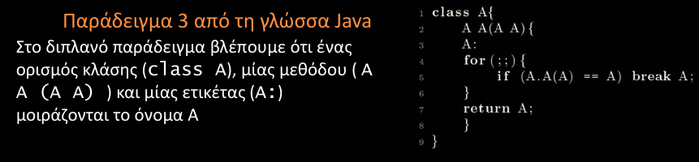
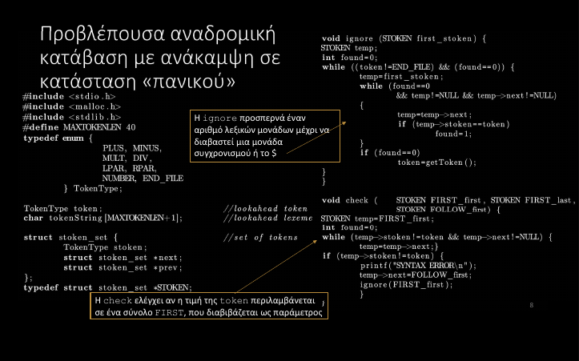
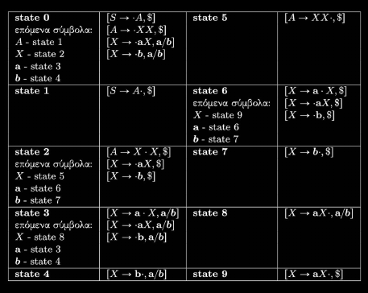
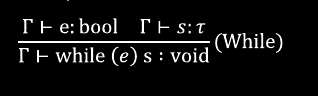
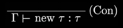
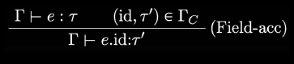
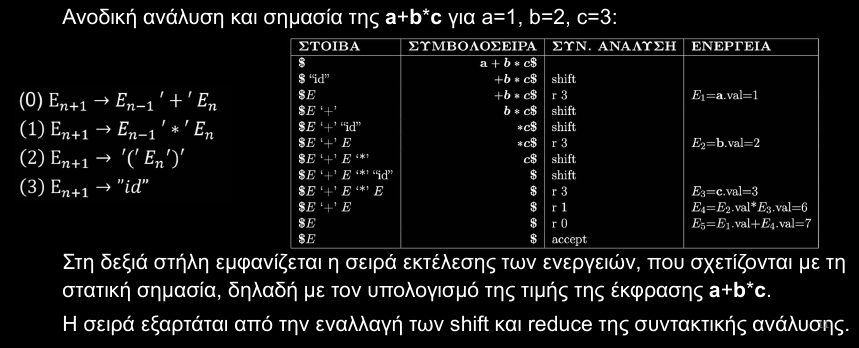
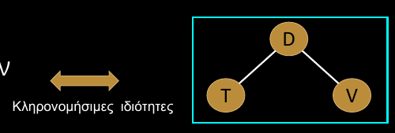
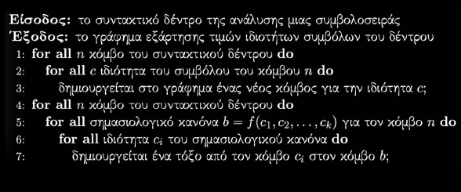

by Μπαζ.
# Δομή Γλωσσών Προγραμματισμού 
Η δομή των Γλωσσών Προγραμματισμού ορίζεται σε 3 επίπεδα:
- **Λέξεων**: πως οι χαρακτήρες σχηματίζουν *στοιχειώδεις λεξικές μονάδες - lexemes*
- **Σύνταξης**: πως συνδιάζονται σε πρόγραμμα τα διάφορα είδη φράσεων
- **Συμφραζόμενων**: πχ. ποιά ονόματα μεταβλητών είναι ενεργά σε ποιά σημεία, εγκυρότητα τύπων, κλπ...


# Λεξική Δομή 
Αφορά:
- Αναγνωρηστικά
- Λεξικές μονάδες

## Αλφάβητο Γλωσσών Προγραμαμτισμού
- Το σύνολο έγκυρων χαρακτήρων που μπορούν να χρησιμοποιηθούν σε μία γλωσσών προγραμματισμού
	- Για το μεταγλωττιστή κάθε χαρακτήρας αντιστοιχεί σε μία μοναδική τιμή (ASCII, UTF-16, κλπ..)
	- Κάποιες γλώσσες διακρίνουν πεζά-κεφαλαία

## Δεσμευμένες Λέξεις - Λέξεις Κλειδιά
- **Δεσμευμένες Λέξεις**: κανένα όνομα στο πρόγραμμα δεν μπορεί να είναι ίδιο με αυτές
- **Λέξεις Κλειδιά**: Λέξεις με ειδική σημασία στη γλώσσα (όχι απαραίτητα δεσμευμένες)

- Συχνά ταυτίζονται ή οι λέξεις κλειδιά είναι *υποσύνολο* των δεσμευμένων
- Μπορεί επίσης να υπάρχουν ονόματα που χρησιμοποιούνται από άλλα κομμάτια του προγράμματος (πχ. βιβλιοθήκες), αλλά η χρήση τους περιορίζεται από το μεταφραστή και όχι από την ίδια τη γλώσσα, οπότε δεν ταυτίζονται με τις παραπάνω κατηγορίες

## Ονόματα
- **Ονόματα**: χρησιμοποιούνται για την *ταυτοποίηση* μεταβλητών, τύπων, ετικετών, διαδικασιών, πακετών και άλλων οντοτήτων
	- Συνήθως επιβάλλονται περιορισμοί στη μορφή τους (πχ. να μην ξεκινούν από αριθμό)
 - Είναι αναγνωρηστικά *μεταβλητού μήκους*
	 - Ο διαχωρισμός τους ακολουθεί την **ταύτηση για τη λεξική μονάδα μεγαλύτερου δυνατού μήκους**
		- δλδ. ως όνομα αναγνωρίζεται πάντα η μεγαλύτερη δυνατή συμβολοσειρά, χωρίς κενά, με ένα μόνο αναγνωριστικό
		-  πχ. η λέξη *doif* δεν ταυτίζεται με τις λέξεις κλειδιά *do* και *if*, αλλά ως ένα όνομα


<div style="page-break-after: always;"></div>

## Τελεστές
- **Τελεστές**: λεξικές μονάδες που συμπεριφέρονται γενικά σαν *συναρτήσεις*, αλλά διαφέρουν *συντακτικά και σημασιολογικά*
	- αριθμητικοί
	- σύγκρισης
	- λογικοί
	- ανάθρσης
	- επιλογής πεδίου σε record (.)
	- ανάλυσης εμβέλειας (::)

- Η κάθε γλώσσα ορίζει σύνολο ενσωμματωμένων τελεστών, και κάποιες φορές δίνει τη δυνατότητα στους προγραμματιστές
	- να τους υπερφορτώσουν
	- να ορίσουν καινούργιους

## Διαχωριστές και Κενά
- **Διαχωριστές ή κενά**: χαρακτήρες που όταν διαβάζονται, επιβάλλουν την απόσπαση αναγνωρηστικών από το υπόλοιπο κείμενο
- Στις περισσότερες γλώσσες, οι λεξικές μονάδες διαχωρίζονται με ένα πλό κενό
- Όλες οι γλώσσες διαθέτουν χαρακτήρες με σημασία
	- *διαχωρισμού εντολών*
	- *τερματισμού εντολών*
	- *συνέχισης σε νέα γραμμή*

## Κυριολεκτικές Σταθερές 
- **Κυριολεκτικές σταθερές**: αναπαριστούν σταθερές τιμές, σε αντίθεση όμως με τις (ορισμένες) σταθερές, μπορούν να έχουν μόνο μία τιμή
	- Συνήθως χρησιμοποιούνται στην αρχικοποίηση μεταβλητών
	- πχ 14, 0.5, "hello", κλπ...

## Σχόλια
Διακρίνονται σε:
- *inline* και *block*
- Αυτά που *αγνωούνται τελείως* και αυτά που *έχουν κάποια σημασία* 
- Υποστηριζουν *ένθεση* ή όχι

<div style="page-break-after: always;"></div>

# Συντακτικό Γλωσσών Προγραμματισμού 
Τα βασικά συντακτικά μέρη των προγραμμάτων είναι:
- **Εκφράσεις**: υπολογισμοί που καθορίζουν τις τιμές τους. Αν μία έκφραση αλλάζε τη συμπεριφορά του προγράμματος, λέμε ότι συνοδεύεται από *παρενέργειες*
- **Εντολές**: οδηγίες που αλλάζουν ρητά τη συμπεριφορά του προγράμματος
	- πχ. x = x + 3, αλλάζει την τιμή της μεταβλητής χ 
- **Δηλώσεις**: εισάγουν νέα ονόματα και ορίζουν τις ιδιότητές τους

Για τον ορισμό των συντακτικών δομών των γλωσσών προγραμματισμού **χρησιμοποιούνται Γραμματικές Χωρίς Συμφραζόμενα** (δες παρακάτω)

## Σύνταξη Προστακτικών και Δηλωτικών Γλωσσών
- Στις **προστακτικές** γλώσσες προγραμματισμού τα προγράμματα αποτελούνται από ακολουθίες εντολών που:
	- εκτελούν υπολογισμούς 
	- αναθέτουν τιμές σε μεταβλητές
	- δέχονται είσοδο ή παράγουν έξοδο
	- εκτρέπυν το έλεγχο σε κάποιο άλλο σημείο της ακολουθίας
- Τα βασικά στοιχεία στις προστακτικές γλώσσες είναι
	- εντολές ανάθεσης
	- επαναληπτικοί βρόγχοι
	- ακολουθίες (blocks) εντολών
	- διαδικασίες
	- υποθετικές εντολές
	- εντολές διαχείρησης εξαιρέσεων

- Στις **συναρτησιακές** γλώσσες προγραμματισμού, η εκτέλεση γίνεται συνήθως με υπολογισμό τιμής εκφράσεων που περιέχουν συναρτήσεις
- Υπάρχουν και γλώσσες με συνδυασμό προστακτικών και δηλωτικών δομών


<div style="page-break-after: always;"></div>

# Σημασία Γλωσσών Προγραμματισμού
- Αναφέρεται σε πληροφορίες σχετικές με τη *συμπεριφορά* και τα *αποτελέσματα εκτέλεσης* ενός προγράμματος
	- Σε αντίθεση με τη σύνταξη που αναφέρεται στην έγκυρη δομή προγραμμάτων

- Ένα πρόγραμμα μπορεί να είναι *συντακτικά ορθό* αλλά *σημασιολογικά λάθος* (εμφανίζει λάθη σε σχέση με τη σημασία της γλώσσας)
- Ένα πρόγραμμα μπορεί να είναι *σημασιολογικά ορθό*, αλλά *λογικά λάθος* (δεν ταιριάζει με τους στόχους του προγραμματιστή)

- Ο ορισμός της σημασίας είναι πιο δύσκολος από τον ορισμό της σύνταξης (μπορεί να περιέχει ασάφιες)
	- *Εγχειρίδιο Αναφοράς της Γλώσσας Προγραμματισμού*: Φυσική γλώσσα, ασαφές, ανακριβές, ελλειπές
	- *Προδιαγραφή και Ανάπτυξη Μεταφραστή*: Απαντά όλα τα ζητήματα σε σχέση με τη σημασία, αλλά επηρεάζεται από λάθη και εξαρτήσεις μηχανής εκτέλεσης
	- *Τυπικός Ορισμός*: μαθηματικές μέθοδοι

## Ιδιότητες Και Συνδέσεις
- **Ιδιότητα**: κανόνας σημασίας ονομάτων
	- μεταβλητών
	- σταθερών
	- διαδικασιών
- πχ.
	- *θέση*: περιοχή μνήμης (αφαιρετική θεώρηση διευθυνσιοδότησης, ξεκινάμε από το 0)
	- *τιμή*: η αποθηκευμένη ποσότητα


- **Σύνδεση (binding)**: Η συσχέτιση μίας ιδιότητας με ένα όνομα 

- *Δηλώσεις*: συντακτικά στοιχεία που συνδέουν ονόματα σε ιδιότητες

==Παράδειγμα==
undefined
undefined

<div style="page-break-after: always;"></div>

- *Εντολές*: μπορούν επίσης να συνδέσουν νέες ιδιότητες ή να αλλάξουν υπάρχουσες

==Παράδειγμα==
undefined
- *Συνδέσεις σε διαφορετικές γλώσσες*
	- Στις καθαρά συναρτησιακές η τιμή συνδέεται σε όνομα μόνο μία φορά και δεν χρειάζεται διαφορετική σύνδεση θέσης, αφού η τιμή δεν αλλάζει
	- Σε πιο δυναμικές γλώσσες, το όνομα μπορεί αν συνδέεται κατά την εκτέλεση με σειρά από διαφορετικές τιμές

- **Χρόνος Σύνδεσης (binding time)**: η χρονική στιγμή υπολογισμού και σύνδεσης ιδιότητας σε όνομα
	- Ανάλογα με το χρόνο σύνδεσης διακρίνουμε
		- **Στατικές Συνδέσεις**: πριν την εκτέλεση (*στατικές ιδιότητες*)
		- **Δυναμικές Συνδέσεις**: κατά την εκτέλεση (*δυναμικές ιδιότητες*)
	- Διαφορετικές γλώσσες είναι πιο κατάλληλες για την κάθε κατηγορία
		- Οι συναρτησιακές στηρίζουν περισσότερο τη δυναμική σύνδεση από τις προστακτικές
		- Οι μεταγλωττιστές στηρίζουν περισσότερο στατικές από τους διερμηνευτές

### Στατικές Συνδέσεις
- Συμβαίνουν κατά την:
	- *Συντακτική ή σημασιολογική ανάλυση* (Χρόνος Μετάφρασης)
	- *Διασύνδεση προγράμματος με βιβλιοθήκες* (Χρόνος Διασύνδεσης)
	- *Φόρτωση προγράμματος στη μνήμη για εκτέλεση* (Χρόνος Φόρτωσης)
	- Κάποιες φορές και πριν από τη μετάφραση, κατά τον ορισμό της γλώσσας

- Ο μεταφραστής δημιουργεί μία *δομή δεδομένων* στην οποία διατηρεί τις συνδέσεις, τον **πίνακα συμβόλων**
- Μπορεί να αναπαρασταθεί ως μία συνάρτηση που εκφράζει τη σύνδεση *ιδιοτήτων σε ονόματα* $$SymbolTable : Names \rightarrow Attributes$$
	- Ο ορισμός της συνάρτησης αλλάζει καθώς εξελίσσεται η μετάφραση, ανάλογα με τη δημιουργία και τη διαγραφή συνδέσεων
- Στη *στατική σημασιολογική ανάλυση* καθορίζονται οι ιδιότητες ονομάτων που εμφανίζονται σε *δηλώσεις* και επιβεβαιώνεται πως *η χρήση τους συμμορφώνεται* με τις δηλωμένες ιδιότητες

<div style="page-break-after: always;"></div>

### Δυναμικές Συνδέσεις
- Συμβαίνουν κατά την:
	- *Είσοδο/Έξοδο* από συναρτήσεις
	- *Είσοδο/Έξοδο* από το πρόγραμμα

- Κατά την εκτέλεση παράγεται κώδικας (από το μεταγλωττιστή) που διατηρεί πληροφορίες για τις ιδιότητες ονομάτων, όπως θέσεις και τιμές, κατά την εκτέλεση
- Το μέρος που συνδέει τις ιδιότητες *θέσης* με *ονόματα*, ονομάζεται **περιβάλλον** $$Environment : Names \rightarrow Locations$$
- Το μέρος που συνδέει τις ιδιότητες *τιμής* με *θέσεις*, ονομάζεται **μνήμη** $$Memory : Locations \rightarrow Values$$
### Ρητές και Έμμεσες Συνδέσεις
- Σε μία δήλωση οι συνδέσεις μπορεί να καθορίζονται
	- *ρητά*: από τον προγραμματιστή 
	- *έμμεσα*: από τους κανόνες της γλώσσας
- Η ίδια σύνδεση μπορεί να γίνει και ρητά και έμμεσα ανάλογα με το πηγαίο πρόγραμμα
- Σε κάποιες γλώσσες μία απλή αναφορά σε όνομα, προκαλεί τη δήλωσή της (συνήθως σε μία εντολή ανάθεσης)
- Στις C/C++ έχουμε *ορισμούς*, δηλώσεις που συνδέουν όλες τις σχετικές ιδιότητες ενός ονόματος
- Σε γλώσσες με *δυναμικούς τύπους*, τα ονόματα έχουν *μόνο σύνδεση τιμής*, ενώ οι ιδιότητες τύπων συνδέονται με τις ίδιες τις τιμές


## Blocks
- *Συντακτικές δομές* που αποτελούνται από μία *αλληλουχία δηλώσεων*, ακολουθούμενη από μία *αλληλουχία εντολών*
	- Η αλληλουχία εντολών περικλείεται συνήθως από *στοιχεία σύνταξης* όπως '{' και '}' ή 'begin' και 'end'
- Στη C τα blocks ονομάζονται και *σύνθετες εντολές*, και εμφανίζονται στο σ΄σμα συναρτήσεων, σε ορισμούς συναρτήσεων και σε θέση οποιασδήποτε εντολής
- Στη C η θέση μίας δήλωσης σε σχέση με ένα block, την κατηγοριοποιεί ως
	- *Τοπική* όταν σχετίζεται με ένα συγκεκριμένο block
	- *Μη Τοπική (εξωτερική ή καθολική)* όταν συμβαίνει εκτός του block

==Παράδειγμα==
undefined

<div style="page-break-after: always;"></div>

- Μπορούμε επίσης να έχουμε *ένθεση* ενός block σε ένα άλλο, σε οποιοδήποτε *βάθος*
	- Τα ίδια ονόματα μπορούν αν δηλώνονται ξανά σε ένθετα blocks 
	- Κάθε νέο όνομα που δηλώνεται το συσχετίζουμε με μία *λεξική διεύθυνση*, δλδ ένα ζεύγος αριθμών που αποτελείται από
		- τον *αριθμό επιπέδου*: ξεκινάει από το 0 στο εξωτερικό επίπεδο και αυξάνεται κατεβαίνοντας επίπεδα
		- τον *αριθμό μετατόπισης*: ξεκινάει από το 0 για κάθε block και αυξάνεται για κάθε όνομα 

==Παράδειγμα==
undefined
## Structs και Κλάσεις
- Στη C ένας *ορισμός struct* αποτελείται από *δηλώσεις τοπικών μεταβλητών*
	- Η σύνταξη μοιάζει με block (άγκιστρα), αλλά στο τέλος έχει ερωτηματικό (σύνθετη δήλωση ?)

==Παράδειγμα==
undefined
- Στις αντικειμενοστρεφείς γλώσσες μπορούμε και να δηλώσουμε *κλάσεις*
	- Είναι η μόνη δήλωση που δεν χρειάζεται να γίνει μέσα σε άλλη κλάση

==Παράδειγμα==


<div style="page-break-after: always;"></div>

## Εμβέλεια Συνδέσεων 
- **Εμβέλεια Σύνδεσης (scope of binding)**: το μέρος του προγράμματος μέσα στο οποίο διατηρείται μία σύνδεση
	- *Εμβέλεια δήλωσης*: όρος που χρησιμοποιείται αν όλες οι συνδέσεις μίας δήλωσης έχουν την ίδια εμβέλεια
	- *Εμβέλεια ονόματος*: όρος που χρησιμοποιείται καταχρηστικά, καθώς το ίδιο όνομα μπορεί να εμφανίζεται σε διαφορετικές δηλώσεις με διαφορετική εμβέλεια για την κάθε μία
- Κανόνας **λεξικής εμβέλειας**:
	- Σε μία γλώσσα που υποστηρίζει ένθετα blocks, η εμβέλεια μίας σύνδεσης περιορίζεται
		- στο block της σχετικής δήλωσης
		- σε κάθε block που περιέχεται σε αυτό
- Κανόνας **δήλωσης πριν τη χρήση**:
	- Η εμβέλεια μίας δήλωσης ξεκινά ακριβώς μετά το σημείο της δήλωσης, και τελειώνει στο τέλος του block στο οποίο βρίσκεται

==Παράδειγμα==
undefined
- Οι δηλώσεις σε ένθετα block έχουν προτεραιότητα έναντι των προηγούμενων δηλώσεων

==Παράδειγμα==
  undefined

- Στο πράδειγμα λέμε ότι η *καθολική* δήλωση της *x* έχει μία *τρύπα στην εμβέλεια* μέσα στην *p*, και ότι η *τοπική δήλωση* της *χ* βρίσκεται *στη σκιά της καθολικής της δήλωσης*
	- Η εμβέλεια μπορεί να περιλαμβάνει και *τρύπες εμβέλειας*: εκεί που οι συνδέσεις εξακολουθούν να υπάρχουν αλλά *δεν είναι ορατές*
	- η  *ορατότητα* μίας δήλωσης περιλαμβάνει μόνο τα μέρη του προγράμματος όπου η συνδέσεις της δήλωσης *εφαρμόζονται*
- στη C++, για να προσπελαύνονται κρυμμένες δηλώσεις, διαθέτιε τον *τελεστή ανάλυσης εμβέλειας "::"*

<div style="page-break-after: always;"></div>

### Εμβέλεια και C
#### Ιδιότητα Διασύνδεσης και Κλάσεις Αποθήκευσης
- Ένα πρόγραμμα C μπορεί να αποτελείται από πολλά πηγαία αρχεία
	- Ο *προεπεξεργαστής* ενσωμματώνει τα αρχεία που αναφέρονται στα \#include, σχηματίζοντας διαφορετικές *μονάδες μεταγλώττισης*
- Η  *ιδιότητα διασύνδεσης* εξαναγκάζει ένα όνομα, που δηλώνεται σε περισσότερες από μία εμβέλειες, ή περισσότερες από μία φορά στην ίδια εμβέλεια, να αναφέρεται στην ίδια οντότητα (μεταβλητή, συνάρτηση, struct)


- Η εμβέλεια δήλωσης ενός ονόματος επηρεάζεται και από την *κλάση αποθήκευσης* με την οποία δηλώνεται:
	- *extern* - προκαθορισμένη κλάση για *ονόματα που δε βρίσκονται μέσα σε συνάρτηση* και για *δηλώσεις συναρτήσεων*
	- *auto* - προκαθορισμένη κλάση για δηλώσεις *εντός συνάρτησης*
	- *static* - δηλώνει ότι η μνήμη εκχωρείται άπαξ (μόνο μία φορά)
	- *register* - δηλώνει ότι μπορεί να αποθηκευτεί σε *καταχωριτή αντί για μνήμη*
- Αν μία δήλωση είναι μέσα σε συνάρτηση και δεν περιέχει τις λέξεις κλειδιά static ή extern, τότε η μνήμη εκχωρείται και απελευθερώνεται με προσέγγιση λειτουργίας στοίβας 


#### Κανόνες Εμβέλειας
1. Ένα όνομα έχει *τοπική εμβέλεια*, αν αυτό δηλώνεται σε συνάρτηση ή block, άρα μπορεί να χρησιμοποιηθεί μόνο στο block/συνάρτηση που το περικλείει
2. Τα ονόματα *παραμέτρων συνάρτησης* έχουν εμβέλεια σε όλο το block με τον κώδικα της συνάρτησης
3. Αν ένα όνομα σε *ένθετο block* είνα ίδιο με όνομα σε block που το περικλείει, τότε η ένθετη δήλωση, *αποκρύπτει* την εμβέλεια της δήλωσης του περικλείοντος block
4. Τα ονόματα *ετικετών(labels)* είναι το μόνα που έχουν *εμβέλεια συνάρτησης*, δλδ η ετικέτα μπορεί να αναφερθεί σε εντολή goto που μπορεί να βρίσκεται ακόμα κα πριν από τη δήλωσή της
5. Ένα όνομα έχει *εμβέλεια αρχείου (καθολική)* αν δε δηλώνεται μέσα σε block
6. Για δηλώσεις ονομάτων με *εμβέλεια αρχείου*, η μνήμη εκχωρείται **άπαξ** και κλάση αποθήκευσης 
	1. την *προκαθορισμένη* ή *auto*,
		1. για *ονόματα συνάρτησης* (δεν μπορούν να είναι auto ή register), η δήλωση έχει το ίδιο επίπεδο διασύνδεσης με οποιαδήποτε άλλη ορατή δήλωση, με εμβέλεια αρχείου για το ίδιο όνομα, αν υπάρχει, αλλιώς **εξωτερική διασύνδεση**
		2. για *ονόματα μεταβλητών, struct, κα.* έχουμε **εξωτερική διασύνδεση**
	2. *extern*, η δήλωση έχει το ίδιο επίπεδο διασύνδεσης με οποιαδήποτε άλλη ορατή δήλωση, με εμβέλεια αρχείου αν υπάρχει, αλλιώς **εξωτερική διασύνδεση**
	3. *static*, η δήλωση έχει **εξωτερική διασύνδεση**
7. Για δηλώσεις ονομάτων με *τοπική εμβέλεια* και κλάση αποθήκευσης
	1. την προκαθορισμένη *auto* ή *register* ή *static*, τα ονόματα είναι **χωρίς διασύνδεση**
	3. *extern* ισχύουν οι ίδιοι κανόνες για δήλωση με εμβέλεια αρχείου, και κλάση αποθήκευσης extern

<div style="page-break-after: always;"></div>

---
Οι κανόνες 5. και 6. περιληπτικά:
- Η **μνήμη εκχωρείται άπαξ**, για όλες τις δηλώσεις με *εμβέλεια αρχείου* και τις δηλώσεις *extern* με τοπική εμβέλεια
- **Χωρίς διασύνδεση**, οι δηλώσεις *τοπικής εμβέλειας*, *auto, register, static* 
- Με **εξωτερική διασύνδεση** όλες οι άλλες, **εκτός από**
	- Δηλώσεις *συναρτήσεων, auto*
	- Δηλώσεις *extern*
	- για τις *οποίες υπάρχει ορατή δήλωση με εμβέλεια αρχείου για το ίδιο όνομα* -> έχουν **ίδια διασύνδεση** με τη άλλη δήλωση
---


## Πίνακας Συμβόλων
- Υποστηρίζει την *εισαγωγή, αναζήτηση και διαγραφή* ονομάτων, μαζί με τις *ιδιότητές* τους και τις συνδέσεις που υλοποιούν οι δηλώσεις τους
- *Επεξεργασία στοίβας* των πληροφοριών εμβέλειας, σε γλώσσα με δομή block
	- κατά την είσοδο σε block, όλες οι δηλώσεις του block υποβάλλονται σε επεξεργασία και οι αντίστοιχες συνδέσεις εισάγονται στον πίνακα συμβόλων
	- κατά την έξοδο από block, οι συνδέσεις που δημιουργήθηκαν από τις δηλώσεις αφαιρούνται, αποκαθιστώντας τυχόν προυπάρχουσες συνδέσεις
- Αν ο πίνακας συμβόλων,
	- δημιουργείται κατά τη μεταγλώττιση, παρέχει πληροφορίες για τη στατική εμβέλεια των ονομάτων
	- διαχειρίζεται πληροφορίες κατά την εκτέλεση του προγράμματος, εκφράζει τη δυναμική εμβέλεια των ονομάτων

### Παραδείγματα Πινάκων Συμβόλων και Εμβέλειας Ονομάτων
#### Στατική Εμβέλεια
==Παράδειγμα== 
undefined

undefined
undefined
undefined

<div style="page-break-after: always;"></div>

#### Δυναμική Εμβέλεια
==Παράδειγμα==
undefined
undefined
undefined


#### Σύνθετες Δομές Δεδομένων
==Παράδειγμα==
undefined

<div style="page-break-after: always;"></div>

## Ανάλυση Ονομάτων
- **Ανάλυση ονομάτων**: η διαδικασία που *συσχετίζει* κάθε *αναφορά ονόματος* με τη *σωστή δήλωση*, σύμφωνα με τη σημασία της γλώσσας

- Χρησιμοποιείται σε πολλές φάσεις της μεταγλώττισης ένας *μηχανισμός επεξεργασίας δηλώσεων μέσω του πίνακα συμβόλων*
	- Μπορεί ένα όνομα να αναφέρεται σε διάφορες οντότητες του προγράμματος, ανάλογα με το πως χρησιμοποιείται

### Υπερφόρτωση
- Σε πολλές γλώσσες προγραμματισμού επιτρέπεται η **υπερφόρτωση** τελεστών και ονομάτων συναρτήσεων
- Η επαναχρησιμοποίηση του ίδιου συμβόλου δεν προκαλέι σύγχυση, επειδή οι διαφορετικές πράξεις σχετίζονται από μαθηματική άποψη μεταξύ τους
	- Η αποσαφήνιση από τον μεταφραστή της χρήσης ενός συμβόλου, γίνεται εξετάζοντας τους *τύπους δεδομένων των τελεστών*

- Οι C++, Java, Ada επιτρέπουν εκτεταμένη υπερφόρτωση ονομάτων και τελεστών
- Η Haskell επιτρέπει την υπερφόρτωση των συναρτήσεων, των τελεστών, καθώς και τον ορισμό νέων τελεστών

#### Υπερφόρτωση Συναρτήσεων
- Υποστηρίζεται από μία λειτουργία *αναζήτησης στον πίνακα συμβόλων* και όχι μόνο με βάση το όνομα μίας συνάρτησης, αλλά λαμβάνοντας υπόψη και τον *αριθμό και τύπο των παραμέτρων*
- Αυτή η διαδικασία λέγεται **ανάλυση υπερφόρτωσης**

- Στην Ada στηρίζεται επίσης και ανάλυση με βάση
	- τον τύπο της *επιστρεφόμενης τιμής*
	- *ονόματα παραμέτρων στον ορισμό* της συνάρτησης

- Σε καποιες περιπτώσεις η υπερφόρτωση συνδιάζεται με τους κανόνες *αυτόματης μετατρωπής τύπων* 

==Παράδειγμα==


#### Υπερφόρτωση Τελεστών
- Κατά την υπερφόρτωση τελεστών, δεν επηρεάζεται ότι σχετίζεται με την σύνταξή τους (προτεραιότητα και προσεταιριστικότητα)
- Οι τελεστές δε διαφέρουν σημασιολογικά από τις συναρτήσες, αλλά *συντακτικά*
	- Οι τελεστές συνήθως εκφράζονται με *ένθετη μορφή*
	  πχ. 2+3
	- Οι συναρτήσεις έχουν *προθεματική σύνταξη* 
	  πχ. add(2,3)

==Παράδειγμα==


<div style="page-break-after: always;"></div>

#### Υπερφόρτωση Ονόματος για Διαφορετικού Τύπου Οντότητες
- Το ίδιο όνομα μπορεί να χρησιμοποιείται για διαφορετικού είδους οντότητες μέσα στο ίδιο πρόγραμμα
  πχ. μία μεταβλητή, έναν τύπο και μία συνάρτηση
	- Δεν επιτρέπεται στις περισσότερες γλώσσες προγραμματισμού
	- Χρήσιμο αν για κάποιο λόγο πρέπει να περιοριστούν τα ονόματα που επιτρέπεται να χρησιμοποιήσει ο προγραμματιστής

==Παράδειγμα==


### Περιβάλλον
- Το **Περιβάλλον** διατηρεί τις συνδέσεις *ονομάτων* με τις *ιδιότητες θέσης* τους $$Environment : Names \rightarrow Locations$$
- Ανάλογα με τη γλώσσα το περιβάλλον εκτέλεσης μπορεί να κατασκευάζεται
	- *Στατικά*: σε χρόνο φόρτωσης (FORTRAN)
	- *Δυναμικά*: σε χρόνο εκτέλεσης (LISP)
	- *Σε συνδιασμό των δύο* (C, C++, Ada, Java)
- Δε συνδέονται θέσεις μνήμης σε όλα τα ονόματα 
	- πχ οι *σταθερές* και οι *τύποι* που έχουν ονόματα, είναι ονόματα που υπάρχουν *μόνο κατά τη μεταγλώττιση* 

- Η κατασκευή του περιβάλλοντος εκτέλεσης εξαρτάται από τις δηλώσεις
	- *μεταγλωττιστής* -> αναλύονται για να δημιουργηθεί ο κατάλληλος κώδικας εκχώρησης μνήμης για κάθε περίπτωση
	- *διερμηνευτής* -> οι συνδέσεις ιδιοτήτων μίας δήλωσης, συμπεριλαμβάνουν και τη σύνδεση *ιδιότητας θέσης*
- Σε γλώσσες με δομή *block*
	- Στις *καθολικές μεταβλητές* μπορεί να εκχωρούνται και θέσεις *στατικά* (οι ιδιότητές τους δεν μεταβάλλονται κατά την εκτέλεση)
	- Στις *τοπικές μεταβλητές* εκχωρούνται θέσεις *δυναμικά*, όταν κατά την εκτέλεση προσεγγίζεται το σχετικό block
	- Η σύνδεση θέσεων σε ονόματα γίνεται με *προσέγγιση στοίβας* (όπως στον πίνακα συμβόλων)

- Για ένα όνομα σε κάποια στιγμή μπορεί να υπάρχουν πολλες διαφορετικές συνδέσεις θέσης, αλλά μόνο μία είναι προσπελάσιμη
	- αυτό ισχύει για όλες τις γλώσσες με δομή block και λεξική εμβέλεια  
- Πρέπει για ένα όνομα να μπορούμε να διακρίνουμε τη δήλωση που έχει προκαλέσει τη σύνδεση συγκεκριμένης θέσης στο όνομα
	- όταν μία θέση έχει εκχωρηθεί ως συνέπεια μίας δήλωσης, λέγεται **αντικείμενο**
	- στη C οι μεταβλητές σε συναρτήσεις συσχετίζονται με αντικέιμενα, σε αντίθεση με τις καθολικές (δεν συνδέονται με θέση μνήμης)

==Παράδειγμα==


<div style="page-break-after: always;"></div>

undefined
undefined
undefined
undefined

<div style="page-break-after: always;"></div>

### Χρόνος Ζωής
- Ο **Χρόνος Ζωής** ενός αντικειμένου αντιπροσωπεύει τη *διάρκεια της εκχώρησης* από το περιβάλλον
- Οι χρόνοι ζωής των αντικειμένων μπορεί να *εκτείνονται έξω από την περιοχή που έιναι δυνατό να προσπελασοτούν*
- Αν η γλώσσα προγραμματισμού υποστηρίζει τη χρήση *δεικτών*, τότε το περιβάλλον εκτέλεσης διαθέτει τη δομή για να παρέχει τις απαραίτητες λειτουργίες
	- Ένας **δείκτης** είναι αντικείμενο, που η αποθηκευμένη τιμή του έιναι αναφορά, που παραπέμπει σε άλλο αντικείμενο

- Σε γλώσσες με δομή block και δυνατότητα εκχώρησης σε σωρό (heap), έχουμε τρία είδη εκχώρησης θέσεων στο πειρβάλλον εκτέλεσης
	- *Στατική* (καθολικές μεταβλητές)
	- *Αυτόματη* (τοπικές μεταβλητές)
	- *Δυναμική* (εκχώρηση σε σωρό)
- Αυτές οι κατηγορίες λέγονται και κλάσεις αποθήκευσης
- Σε γλώσσες όπως η C επιτρέπεται και η δήλωση κλάσης αποθήκευσης, μαζί με τον τύπο δεδομένων

## Μεταβλητές
- **Μεταβλητή**: είναι ένα αντικείμενο, που η αποθηκευμενη τιμή του αλλάζει κατά την εκτέλεση του προγράμματος
- Κάθε μεταβλητή ορίζεται πλήρως από τις ιδιότητές της, που έιναι το *όνομα*, η *θέση* της και ο *τύπος* της και το *μέγεθος του χώρου* που καταλμβάνει


### Εντολές Ανάθεσης με Σημασία Αντιγραφής
- Η τιμή μίας μεταβλητής *αλλάζει*, με εντολή ανάθεσης *x = e*, όπου *x* είναι το όνομα μεταβλητής και *e* είναι μία έκφραση
	- Η σημασία αυτής της εντολής είναι ότι η *e αποτιμάται σε μία τιμή* και στη συνέχεια αντιγράφεται στη *θέση της x*
	- Εάν *e* είναι όνομα μεταβλητής, (έστω *y*), τότε η ανάθεση *x = y* απεικονίζεται ως


<div style="page-break-after: always;"></div>

#### l-τιμές και r-τιμές
- Καθώς μία μεταβλητή βρίσκεται σε μία θέση και έχει μία αποθηκευμένη τιμή, πρέπει να γίνεται διάκριση μεταξύ αυτών
	- η *τιμή* που βρίσκεται στη θέση μίας μεταβλητής, αποκαλείται συχνά **r-τιμή** (εμφανίζεται *δεξιά* στην εντολή ανάθεσης)
	- η *θέση* μίας μεταβλητής λέγεται και **l-τιμή** (εμφανίζεται *δεξιά* στην εντολή ανάθεσης)
- Η C επιτρέπει την ανάμειξη εκφράσεων με αναθέσεις, όπου μπορεί να έχουμε την r-τιμή και την l-τιμή μίας μεταβλητής
	- πχ *x = x + 1;*
- Μπορούμε επίσης να ανακτήσουμε τη διεύθυνση μίας μεταβλητής με τη μορφή *δείκτη* 
	- *&x* είναι ένας δείκτης στη διεύθυνση της *x*
	- με *\*&x*  παίρνουμε πάλι την τιμή της *x* ως l-τιμή αλλά και r-τιμή
- Αυτά τα χαρακτηριστικά καθιστούν τον προγραμματισμό σε C επιρρεπή σε μη προβλεπόμενες χρήσεις μεταβλητών, που δεν εντοπίζονται εύκολα

### Εντολές Ανάθεσης με Σημασία Κοινής Χρήσης
- Σε κάποιες γλώσσες, η εντολή ανάθεσης έχει διαφορετική σημασία: αντί για τις τιμές, *αντιγράφονται οι θέσεις*
- Αυτή η περίπτωση λέγεται **ανάθεση με κοινή χρήση**
- Η εντολή *x = y* προκαλεί τη σύνδεση της θέσης της *y* στην *x*

- Η Java υποστηρίζει την ανάθεση με κοινή χρήση για όλες τις μεταβλητές *αντικειμένων*, αλλά όχι για απλά δεδομένα


## Σταθερές
- Μία **σταθερά** είναι μία οντότητα που έχει *σταθερή τιμή* σε όλη τη διάρκεια ύπαρξής της σε ένα πρόγραμμα
- Διαφέρει από της μεταβλητές, στο ότι η σταθερά δεν έχει συνδεδεμένη ιδιότητα θέσης, αλλά μόνο μία τιμή. Λέμε ότι μία σταθερά έχει *σημασία τιμής ατνί για σημασία αποθήκευσης μίας μεταβλητής*
undefined
- Η σταθερά μπορεί να παίρνει τιμή, που γίνεται γνωστή μόνο κατά την εκτέλεση του προγράμματος. Τότε θα πρέπει να αποθηκευτεί η τιμή της στην μνήμη
	- Αντίθετα από μία μεταβλητή, όταν η τιμή μίας σταθεράς υπολογίζεται, δεν μπορεί να μεταβληθεί
- Σε πολλές γλώσσες, και ιδιέταιρα στις *συναρτησιακές*, δίνεται έμφαση στη χρήση σταθερών αντί για μεταβλητές, λόγω της *πολύ απλούστερης σημασίας* τους
	- Κάθε όνομα σταθεράς εκφράζει μόνο μία τιμή, που μετά τη δημιουργία της παραμένει αμετάβλητη, ανεξάρτητα από τη θέση ή τη χρήση της στο πρόγραμμα
- Μερικές γλώσσες όπως η Haskell, απαγορεύουν εντελώς τη χρήση μεταβλητών και στηρίζονται αποκλειστικά στη χρήση σταθερών για υπολογισμούς

### Στατικές και Δυναμικές Σταθερές
- Οι σταθερές μπορεί να έιναι 
	- **Στατικές**: η τιμή τους μπορεί να υπολογιστεί πριν από την εκτέλεση
		- **Χρόνου Μεταγλώττισης**
		- **Χρόνου Φόρτωσης**: υπολογίζονται σε χρόνο φόρτωσης ή στην αρχή εκτέλεσης του προγράμματος
	- **Δυναμικές**: αυτές που μπορούν να υπολογιστούν μόνο στο *χρόνο εκτέλεσης*


## Ψευδωνυμία
- Όταν ένα αντικείμενο συνδέεται ταυτόχρονα με δύο διαφορετικά ονόματα, λέμε ότι έχουμε ένα **ψευδώνυμο**
- Η ψευδωνυμία μπορεί να συμβέι με διαάφορους τρόπους, όπως κατά την *κλήση διαδικασιών*, χρήση *μεταβλητών δείκτη*, ή όταν γίνεται *ανάθεση με κοινή χρήση*
- Τα ψευδώνυμα μπορεί να έχουν πιθανώς *επιβλαβείς παρενέργειες*
	- ως παρενέργεια εντολής ορίζουμε κάποια μεταβολή στην τιμή μίας μεταβλητής, που διατηρείται μετά την εκτέλεσή της
	- δεν είναι όλες οι παρενέργειες επιβλαβείς: η ανάθεση τιμής σε μία μεταβλητή αλλάζει την τιμή της, όπως ρητά επιδιώκεται από τη σημασία της εντολής
	- όμως παρενέργειες, όπως αλλαγές σε μεταβλητές, που δεν αναφέρονται ρητά τα ονόματά τους στην εντολή, είναι πιθανώς επιβλαβείς

==Παραδείγματα==


<div style="page-break-after: always;"></div>

## Αιωρούμενες Αναφορές
- **Αιωρούμενη Αναφορά** είναι μία θέση μνήμης, που έχει ανακληθεί η εκχώρησή της από το περιβάλλον, αλλά εξακολουθεί να είναι προσπελάσιμη μέσα από το πρόγραμμα (δηλαδή όταν ένα αντικείμενο είναι προσπελάσιμο πέρα από το χρόνο ζωής του στο περιβάλλον)
- Το πρόβλημα παρουσιάζεται με τη χρήση μεταβλητών δείκτη
- Στη C μπορεί επίσης να έχουμε αιωρούμενες αναφορές λόγω αυτόματης ανάκλησης της εκχώρησης τοπικών μεταβλητών κατά την έξοδο από το block στο οποίο δηλώνονται. Αυτό συμβαίνει λόγω του τελεστή διεύθυνσης "*&*"

==Παραδείγματα==
undefined
undefined
undefined
undefined
undefined


<div style="page-break-after: always;"></div>


# Γραμματικές Χωρίς Συμφραζόμενα
**Γραμματική Χωρίς Συμφραζόμενα (Γ.Χ.Σ)**
$G = (V,Σ,R,S)$
όπου:
- $V$ το *αλφάβητο*, ένα πεπερασμένο σύνολο συμβόλων
- $Σ \subseteq V$ τα *τερματικά σύμβολα*, ενώ $V - Σ$ τα *μη-τερματικά* σύμβολα
- $R$ ένα σύνολο *κανόνων παραγωγής* της μορφής
	- $A \rightarrow u$, με
		- $A \in V - Σ$
		- $u \in V^*$ μία συμβολοσειρά από σύμβολα
- $S \in V - Σ$ ένα ένα μη τερματικό σύμβολο που λέγεται *αρχή* της $G$


## Παραγωγή
- Αν η συμβολοσειρά $w \in Σ^*$ παράγεται από την αρχή $S$ μέσω κανόνων της $G$, γράφουμε $S \Rightarrow^* w$ και $w \in L(G)$-*η γλώωσα της $G$*
- Σ'αυτή τηνπερίπτωση λέμε ότι η $w$ *συμμορφώνεται στη σύνταξη* των προτάσεων της γλώσσας της $G$
==Παράδειγμα==


- **Αριστερή Παραγωγή**: όταν σε κάθε βήμα εφαρμόζουμε κανόνα στο *πρώτο μη-τερματικό από τα αριστερά*
- **Δεξιά Παραγωγή**: όταν σε κάθε βήμα εφαρμόζουμε κανόνα στο *πρώτο μη-τερματικό από τα δεξιά*

<div style="page-break-after: always;"></div>


## Παράγωγα ή Συντακτικά Δέντρα
- Η σύνταξη ενός προγράμματος αποτυπώνεται στο **παράγωγο/συντακτικό δέντρο**

**Παράγωγο/Συντακτικό Δέντρο**
Έστω ΓΧΣ $G = (V,Σ,R,S)$
- Για κάθε σύμβολο $a \in Σ$, το γράφημα με ένα μόνο κόμβο $a$ είναι πράγωγο δέντρο, με ρίζα και μοναδικό φύλλο τον $a$
  
- Αν $A \rightarrow ε$ είναι κανόνας του $R$ με $ε$ την κενή συμβολοσειρά, τότε το παρακάτω είναι παράγωγο δέντρο, με ρίζα τον $A$ και μοναδικό φύλλο το $ε$
  
- Αν τα πρακάτω είναι παράγωγα δέντρα με ρίζες τα $A_1,A_2,...A_n$ και παραγώμενες συμβολοσειρές τις $y_1,y_2,...y_n$
  
  και αν $A \rightarrow A_1A_2...A_n$ είναι κανόνας του $R$, τότε το παρακάτω είναι παράγωγο δέντρο με ρίζα $A$ και παραγόμενη συμβολοσειρά την $y_1 \cdot y_2....y_n$
  

==Παράδειγμα==


<div style="page-break-after: always;"></div>

### Αφαιρετικά Συντακτικά Δέντρα
- Τα παράγωγα δέντρα διατηρούν όλη την πληροφορία σχετικά με την παραγωγή μίας συμβολοσειράς από μία γραμματική
- Μέρος αυτής της πληροφορίας δεν επηρεάζει τη σημασία της γλώσσας προγραμματισμού και μπορεί να παραληφθεί για την απλούστευση του δέντρου
- Το **Αφαιρετικό συντακτικό δέντρο** δεν περιλαμβάνει όλες τις πληροφορίες

==Παράδειγμα==


## Διφορούμενες ή Ασαφείς Γραμματικές
- Μία ΓΧΣ λέγεται **διφορούμενη ή ασαφής** όταν υπάρχει πρόταση της γλώσσας με τουλάχιστον δύο παράγωγα δέντρα (δύο διαφορετικές αριστερές ή δεξιές παραγωγές)
- Η ΓΧΣ που περιγράφει τη σύνταξη μίας γλώσσας δεν πρέπει να είναι διφορούμενη, ή αν είναι, το πρόβλημα πρέπει να αντιμετοπίζεται κατά τη μεταγλώττιση

### Ασάφεια Προτεραιότητας Τελεστών 
==Παράδειγμα==


<div style="page-break-after: always;"></div>

- Για να διορθώσουμε το πρόβλημα ασάφειας προτεραιότητας τελεστών:
	- Ομαδοποιούμε τους τελεστές με την ίδια προτεραιότητα σε κανόνα με κοινό μη-τερματικό σύμβολο


### Ασάφεια Πορσεταιριστικότητας Τελεστών
==Παράδειγμα==

- Για να διορθώσουμε το πρόβλημα ασάφειας προσεταιριστικότητας τελεστών:
	- Ένας κανόνας ΓΧΣ παράγει δέντρο με αριστερή προσεταιριστικότητα αν αυτός είναι *αποκλειστικά αριστερά αναδρομικός*


<div style="page-break-after: always;"></div>

### Ασάφεια Μετέωρου Else
==Παράδειγμα==


## Συμβολισμός BNF/EBNF
- **BNF (Backus Normal Form)**
	- Τα μη-τερματικά σύμβολα περικλείονται από $<$ και $>$ 
	- Για κανόνες παραγωγής χρησιμοποιείται το $\rightarrow$ ή κάποιες φορές το $::=$ 
	- Οι κανόνες παραγωγής για το ίδιο μη-τερματικό αναφέρονται σε έναν ενιαίο κανόνα
- **EBNF (Extended BNF)**


==Παράδειγμα==


## Συντακτικά Διαγράμματα
- **Συντακτικό Διάγραμμα**: μία γραφική παράσταση κανόνων EBNF
	- *τετράγωνα*: μη-τερματικά 
	- *κύκλοι*: τερματικά
	- *τόξα*: δομές ακολουθίας ή επιλογής
	- *αριστερό μέρος*: μη-τερματικό του οποίου ο κανόνας αναπαριστάται

==Παραδείγματα==

undefined
undefined


<div style="page-break-after: always;"></div>

## Κανονικές Εκφράσεις
**Κανονικές Εκφράσεις (Ορισμός)**
- Δοθέντος *πεπερασμένου αλφαβήτου* $Σ$, **Κανονικές Εκφράσεις** είναι οι *σταθερές*
	- $\emptyset$: το **κενό σύνολο**
	- $ε$: το σύνολο με την **κενή συμβολοσειρά**
	- $a$: το σύνολο με τη συμβολοσειρά $a$, όπου $a \in Σ$
- Δοθέντων των *Κανονικών Εκφράσεων* $R$ και $S$, ορίζουμε επίσης τις ακόλουθες πράξεις ως Κ.Ε.
	- $R \cdot S = \{ab| a \in R, b \in S\}$: η **Παράθεση** της $R$ με την $S$
	- $R|S = \{a |a \in R \cup S \}$: η **Διάζευξη** της $R$ με την $S$
	- $R^*$: η **Kleene Star** της $R$, το ελάχιστο υπερσύνολο της $R$ που περιλαμβάνει την $ε$ και είναι *κλειστό προς την παράθεση*

- Η **Kleene Star** $R^*$ εκφράζει το *σύνολο* όλων των *συμβολοσειρών* που σχηματίζονται με *παράθεση πεπερασμένου αριθμού (ή μηδέν)* *συμβολοσειρών* της $R$ 
	- πχ 

- **Προτεραιότητα Τελεστών**: υποθέτουμε πως η προτεραιότητα πράξεων πάει ως εξής:
	1. *Kleene Star*
	2. *Παράθεση*
	3. *Διάζευξη*

<div style="page-break-after: always;"></div>


## Κ.Ε. -> Ελάχιστο ΝΠΑ
### Κ.Ε. -> Συντακτικό Δέντρο
- Απλό
==Παράδειγμα==


### Συντακτικό Δέντρο -> ΜΝΠΑ 
- **Ανάπτυξη Thompson**
	- ΜΝΠΑ **Κενής Συμβολοσειράς** $ε$
	  
	- ΜΝΠΑ **Χαρακτήρα - Πρότυπο** $a$
	  
	- ΜΝΠΑ **Παράθεσης** $r \cdot s$
	  
	- ΜΝΠΑ **Διάζευξης** $r|s$
	  
	- ΜΝΠΑ **Kleene Star** $r^*$
	  	
 - Συνδιάζοντας τα παραπάνω ΜΝΠΑ χτίζουμε το τελικό ΜΝΠΑ από το *φύλλα* πρός τη *ρίζα* του Συντακτικού Δέντρου
==Παράδειγμα==
 
 
### ΜΝΠΑ -> ΝΠΑ
- Βρίσκουμε την **ε-Κλειστότητα** κάθε κατάστασης του ΜΝΠΑ 
	- **ε-Κλειστότητα** της $s$ : $C_ε(s)$ το σύνολο όλων των καταστάσεων που μπορούν να προσεγγιστούν αποκλειστικά με *ε-μεταβάσεις* από την $s$
==Παράδειγμα==

- Το νέο σύνολο καταστάσεων είναι η *ε-κλειστότητα* κάθε κατάστασης του αρχικού Αυτόματου, δηλαδή σύνολο από καταστάσεις
- Η νέα *Συνάρτηση Μετάβασης* ορίζεται ως $$Δ(R,s) = \cup _{\forall r \in R} \space C_ε(δ(r,s))$$
	- Για κάθε σύνολο από καταστάσεις $R$, η μετάβαση του μέσω κάποιου συμβόλου $s$, οδηγεί στην ένωση, από τις *ε-κλειστότητες*, των καταστάσεων στις οποίες οδηγούμασταν, από τις καταστάσεις του $R$
- Η *Αρχή* του ΝΠΑ είναι η ε-κλειστότητα της αρχής του ΜΝΠΑ
- Οι *τελικές καταστάσεις* του ΝΠΑ είναι όλες οι καταστάσεις που περιέχουν τελικές καταστάσεις του ΜΝΠΑ

==Παράδειγμα==

### ΝΠΑ -> Ελάχιστο ΝΠΑ
- Χωρίζουμε τις καταστάσεις σε δύο κλασεις $A,B$, όπου
	- $A$ οι μη-τελικές καταστάσεις του ΝΠΑ
	- $B$ οι τελικές καταστάσεις του ΝΠΑ
- Αναδρομικά ελέγχουμε αν σε κάθε κλάση, όλες οι μεταβάσεις, οδηγούν στην ίδια κλαση
	- δλδ αν $\forall a \in A, Δ(a,s) \in A ή Δ(a,s) \in B, \forall s \in Σ$ η $A$ είναι εντάξει
- Αν ένα υποσύνο μίας κλάσεις έχει διαφορετικά αποτελέσματα, δημιουργούμε νέα κλαση και επαναλαμβάνουμε τη διαδικασία, μέχρι κάθε κλαση να χαρακτηρίζεται από όμοιες μεταβάσεις σε άλλες κλάσεις
- Το *Ελαχιστοποιημένο ΝΠΑ* έχει μία κατάσταση για κάθε κλαση του ΝΠΑ, και η μετάβαση από κάθε κατάσταση είναι προφανής
==Παράδειγμα==
undefined

# Γεννήτρια Λεξικού Αναλυτή
- Η **Γεννήτρια Λεξικού Αναλυτή** είναι ένα πρόγραμμα που δέχεται ως είσοδο ένα σύνολο από *ορισμούς αναγνωριστικών σε μορφή Κανονικών Εκφράσεων* και παράγει ως έξοδο έναν λεξικό αναλυτή
- Ένα πρόγραμμα λεξικού αναλυτή πρέπει να μπορεί να
	- *Διακρίνει* διάφορους τύπους *αναγνωρηστικών* (πχ αριθμούς, μεταβλητές, λέξεις κλειδιά, κλπ...)
	- Αποκόπτει τη σευμβολοσειρά εισόδου σε πολλά μέρη, που το καθένα ανήκει σε μία από τις γλώσσες των Κανονικών Εκφράσεων
	- Αποφασίζει με ποιό τρόπο θα προχωρήσει αν υπάρχουν πολλοί διαφορετικοί τρόποι αποκοπής της εισόδου σε επιμέρους συμβολοσειρές

<div style="page-break-after: always;"></div>

## Τρόπος Λειτουργείας
- **Απλή Προσέγγιση**
	- Σύνθεση ενός ΝΠΑ για κάθε ορισμό αναγνωρηστικού και προσωμοίωσή, με τη σειρά, ένα προς ένα
	- Αρκετά αργή λύση. Προτιμάται η σύνθεση *ενός μόνο* ΝΠΑ από το σύνολο ορισμών, που προσομοιώνει ταυτόχρονα όλους τους ορισμούς αναγνωρηστικών
- **"Πραγματική" Προσέγγιση**
	1. Δημιουργεία ΜΝΠΑ για κάθε ΚΕ αναγνωρηστικού
	2. *Επισημείωση των καταλήξεων* κάθε ΜΝΠΑ με το όνομα του αναγνωρηστικού που δέχονται
	3. *Συνδιασμός* των ΜΝΠΑ σε ένα ενιαίο ΜΝΠΑ, με την προσθήκη μίας νέας αρχικής κατάστασταση και ε-μεταβάσεις στην αρχή κάθε επιμέρους ΜΝΠΑ
	4. Μετατροπή του ενιαίου ΜΝΠΑ σε ΝΠΑ
	5. Κάθε κατάληξη του ΝΠΑ θα αποτελείται από ένα σύνολο καταστάσεων του ΜΝΠΑ με τουλάχιστον μία κατάληξη από αυτές του βήματος 2. Η επισήμανση χρησιμοποιείται για την αναγνώρηση του *τύπου* του αναγνωρηστικού
- **Συγκρούσεις**
	- Από τη διαδικασία μετατροπής ΜΝΠΑ σε ΝΠΑ, μία κατάληξη του ΝΠΑ μπορεί να αντιστοιχεί σε πολλαπλές επισημανσμένες καταλήξεις του ΜΝΠΑ. Στην περίπτωση που ο τύπος ενός αναγνωρηστικού είναι αμφίβολος, μπορούμε
		- Ο λεξικός αναλυτής να παράγει λάθος, ενώ προσπαθούμε οι ορισμοί να είναι αμοιβαίως αποκλειώμενοι, δλδ αν μην υπάρχουν συμβολοσειρές που αναγνωρίζονται με πάων από έναν τύπο
		- Ο χρήστης της γενήτριας να επιλέγει ποιό από τα αναγνωρηστικά προτιμάται
			- Συνήθως η επικάλυψη αντιμετοπίζεται συμερίζοντας την σειρά εμφάνισης των αναγνωρηστικών στην είσοδο της γεννήτριας Λ.Α.

==Παράδειγμα==


<div style="page-break-after: always;"></div>

# Flex
## Κανονικές Εκφράσεις


## Σύνταξη


==Παράδειγμα==


- Αν κάποια συμβολοσειρά ταυτίζεται με περισσότερους από έναν ορισμούς, , η Flex την ταυτίζει με τον νωρίτερα ορισμένο ορισμό
- Αν κάποια συμβολοσειρά παράγεται από μία Κ.Ε. και ταυτόχρονα είναι μέρος μεγαλύτερης λεξικής μονάδας, τότε η Flex την αναγνωρίζει ως μέρος της μεγαλύτερης λεξικής μονάδας 


# Συντακτική Ανάλυση

Η **Συντακτική Ανάλυση - Σ.Α.** δέχεται αναγωνριστικά που συγκροτούν το πηγαίο πρόγραμμα, του οποίου τη συντακτική δομή θα αναγνωρίσει/καταγράψει
- Αν το πρόγραμμα *συμμοφρώνεται* στον ορισμό σύνταξης της Γλ.Πρ., τότε η ΣΑ μπορεί να *καταγράφει τη δομή του σε μορφή συντακτικού δέντρου*, την ενδιάμεση αναπαράσταση (υπάρχουν και γραμμικές ενδιάμεσες αναπαραστάσεις)
- Αν το πρόγραμμα *δεν συμμορφώνεται* στον ορισμό σύνταξης της Γλ.Πρ., τότε ο αλγόριθμος ΣΑ, *εντοπίζει ένα συντακτικό λάθος*, και μετά εκτελεί μία *διαδικασία ανάκαμψης*, ώστε να *συνεχίσει η ΣΑ* μέχρι το τέλος του Προγράμματος
- Η ΣΑ κατά τη λειτουργεία της ενεργοποιεί τους *ελέγχους* που σχετίζονται με τη *σημασία του προγράμματος* - αντλούνται πληροφορίες από το *συντακτικό δέντρο* και τον *πίνακα συμβόλων*
- Το *συντακτικό δέντρο* αντικατοπτρίζει τη *σειρά ανίχνευσης* των *αναγνωρισιτικών* στη δομή του προγράμματος
- **Μετάφραση σε ένα πέρασμα**: όταν μία μόνο διάσχιση του δέντρου αρκεί για την εκτέλεση *σημασιολογικών ελέγχων* και δεν αποθηκεύεται κάποια δομή δεδομένων στη μνήμη
- **Μετάφραση σε πολλά περάσματα**: για πιο απαιτητικούς σημασιολογικούς ελέγχους, που αποθηκεύεται η δομή του συντακτικού δέντρου

<div style="page-break-after: always;"></div>

# Ανάκαμψη από Λάθη
- Οι τεχνικές ανάκαμψης, που μπορούν να εφαρμοστούν, εξαρτώνται από τη μέθοδο ανάλυσης
- Γενικές αρχές
	- Ο εντοπισμός λάθους είναι *αποτελεσματικός*, όταν γίνεται *έγκαιρα*. Προτιμώνται αλγόριθμοι με μηχανισμούς πρόβλεψης του κανόνα που θα εφαρμοστεί
	- Ο μεταγλωττιστής θα πρέπει να εντοπίζει *πραγματικά λάθη* και όχι υποτιθέμενα λάθη εξαιτίας της διαδικασίας ανάκαμψης από το προηγούμενο λάθος (*διαδιδόμενα λάθη*)
	- Μετά το εντοπισμό λάθους πρέπει να επιλέγεται σημείο συνέχισης της ανάλυσης, δηλαδή εκεί που *ξαναενεργοποιείται η δυνατότητα εντοπισμού* λαθών
	- Θα πρέπει να αποκλείεται η πιθανότητα μετάπτωσης του αναλυτή σε *αέναους βρόγχους* επανάληψης, που δεν επιτρέπουν τη συνέχιση της ανάγνωσης του πηγαίου προγράμματος

## Στρατηγικές Ανάκαμψης από Λάθη
- Διακρίνουμ *4* βασικές στρατηγικές ανάκαμψης
	1. Ανάκαμψη σε κατάσταση **"Πανικού"**
	   Μετά από τον εντοπισμό λάθους "αγνωούνται" λεξικές μονάδες, μέχρι να βρεθεί μία από την οποία μπορεί να συνεχίσει με ασφάλεια την ανάλυση (*μονάδες συγχρονισμού* πχ. επιλεγμένοι διαχωριστές)
	   Πλεονεκτίματα: απουσία αέναων βρόγχων και διαδιδόμενων λαθών, για όσο αγνούνται λεξικές μονάδες μετά τον εντοπισμό λάθους
	2. Ανάκαμψη σε **επίπεδο φράσης**
	   Μπορεί να αντικαθίσταται, μετά από λάθος, ένα πρόθεμα της εναπομείνασας εισόδου, ώστε να μπορεί να συνεχίσει την ανάλυση
	   πχ. Αντικατάσταση κόμματος με ερωτηματικό, εισαγωγή ερωτηματικού εκεί που πρέπει να υπάρχει
	   Χρειάζεται προσοχή στην επιλογή των επιτρεπτών διορθώσεων, ώστε να αποφεύγονται οι αέναοι βρόγχοι. Δεν είναι πάντα εύκολη η εφαρμογή της
	3. **Κανόνες παραγωγής για λάθη**:
	   Αν υπάρχει δυνατότητα πρόβλεψης των λαθών, μπορούν να διατυπωθούν επιπλέον κανόνες παραγωγής, που καθοδηγούν την ανάλυση, όταν αναγνωρίζονται αυτά τα λάθη
	   Κάθε φορά που χρησιμοποιείται από τον αναλυτή ένας τέτοιος κανόνας, παράγεται και κατάλληλο διαγνωστικό μήνυμα
	4. **Συνολική Διόρθωση**
	   Η υλοποίησή της εππιτυγχάνεται με την εφαρμογή κατάλληλου αλγορίθμου διόρθωσης λαθών, με όσο το δυνατόν μικρότερο αριμθμό αλλαγών. Αυτοί οι αλγόριθμοι έχουν αποδειχθεί  πολύ δαπανηροί στην πράξη, και είναι περισσότερο θεωρητικού, παρά πρακτικού ενδιαφέροντος


<div style="page-break-after: always;"></div>


# Ορισμός Σύνταξης Γλώσσας Προγραμματισμού
- Για τον ορισμό της συντακτικής δομής των γλωσσών προγραμματισμού, χρησιμοποιούνται **Γραμματικές Χωρίς Συμφρζόμενα**
	- *Τερματικά σύμβολα* είναι τα *αναγνωρηστικά* (γράφονται με **bold**)
	- *Μη τερματικά σύμβολα* εκφράζουν τις *συντακτικές δομές* της γλώσσας (assig-stmt, expr, term...) (γράφονται με *italics*)
	- Η *Αρχή* της ΓΧΣ αντιστοιχεί σε ένα οποιοδήποτε πρόγραμμα (σλυμβολο στο *αριστερό μέρος του πρώτου κανόνα*)
==Παράδειγμα==


<div style="page-break-after: always;"></div>


# Κατηγοριοποίηση Γραμματικών
## Το σύνολο FIRST
- Αν $\overline u$ είναι συμβολοσειρά που αποτελείται από *μη-τερματικά ή/και τερματικά* σύμβολα μίας γραμματικής, τότε $$FIRST(\overline u) = \{t|\overline u \Rightarrow^* t \overline o\}$$
   το σύνολο των $t$ (*τερματικών συμβόλων* ή $ε$) που μπορεί να εμφανίζονται στην αρχή όλων των συμβολοσειρών, που παράγονται από τη $\overline u$ μέσω κανόνων
### Αλγόριθμος Υπολογισμού FIRST
- Είσοδος: Γραμματική $G = (N,T,S,P)$ και μία προτασιακή μορφή $\overline u$
- Έξοδος: το σύνολο $FIRST(\overline u)$

- Αν το $\overline u$ είναι *τερματικό ή $ε$*, το $FIRST(\overline u) = \{\overline u\}$
- Αν το $\overline u$ είναι *μη-τερματικό*, το $FIRST(\overline u)$ είναι η *ένωση* των $FIRST$ όλων των *συμβολοσειρών που μπορούν να παραχθούν με έναν κανόνα από το $\overline u$* 
- Αν το $\overline u$ είναι *σύζευξη από τερματικά ή/και μη τερματικά* $x_1x_2...x_n$
	- Παίρνουμε με τη σειρά κάθε επιμέρους σύμβολο $x_j$ και προσθέτουμε στο $FIRST(\overline u)$, το $FIRST(x_j) - \{ε\}$
	- Μέχρι να βρούμε $x_j$ που να μην παράγει το $ε$, ή να τελειώσουν τα σύμβολα
	- Αν η $\overline u$ παράγει το $ε$, το προσθέτουμε στη $FIRST(\overline u)$


<div style="page-break-after: always;"></div>

## Το Σύνολο FOLLOW
- Αν $X$ ένα *μη-τερματικό* σύμβολο, τότε $FOLLOW(X)$ το σύνολο των *τερματικών* συμβόλων που μπορεί να εμφανιστούν *αμέσως μετά* από αυτό, σε όλες τις περιπτώσεις παραγώμενων συμβολοσειρών

### Αλγόριθμος Υπολογισμού 
- Είσοδος: Γραμματική $G = (N,T,S,P)$ και ένα μη-τερματικό $X$
- Έξοδος: το σύνολο $FOLLOW(X)$

- Αν $X$ είναι η *αρχή* της γραμματικής, τότε βάζουμε το $\$$ στο $FOLLOW(X)$
- Για κάθε κανόνα της γραμματικής, μορφής $Y \rightarrow \overline m X \overline o$ (με το $X$ στο δεξί του μέρος)
	- αν το $\overline o$ *αρχίζει με τερματικό*, βάλε αυτό το τερματικό στο $FOLLOW(X)$
	- αν το $\overline o$ *αρχίζει με μη-τερματικό*, βάλε το $FIRST(\overline o) - \{ε\}$ στο $FOLLOW(X)$
	- αν το $\overline o$ *έιναι ή παράγει $ε$*, βάλε το $FOLLOW(Y)$ στο $FOLLOW(X)$

==Παράδειγμα==


## Γραμματικές  LL(1)
- Μία γραμματική είναι $LL(1)$ αν-ν
	1. Για κάθε *κανόνα* $X \rightarrow \overline{u_1}|\overline{u_2}|...|\overline{u_n}$ ισχύει $$FIRST(\overline{u_i}) \cap FIRST(\overline{u_j}) = \emptyset$$ για όλα τα $i,j = 1...n$ με $i \neq j$
	2. Για κάθε *μη-τερματικό* $X$, τέτοιο ώστε $ε \in FIRST(X)$ ισχύει $$FIRST(X) \cap FOLLOW(X) = \emptyset$$


## Απομάκρυνση Αριστερής Αναδρομικότητας
### Άμεση Αριστερή Αναδρομικότητα
- Πρόβλημα με κανόνα παραγωγής του τύπου $$X \rightarrow X \overline u_1| X\overline u_2|...|X \overline u_n |\overline o_1|\overline o_2|...|\overline o_m $$
	- $\overline u_i$: συμβολοσειρές από τερματικά ή/και μη-τερματικά
	- $\overline o_j$: συμβολοσειρές από τερματικά ή/και μη-τερματικά *που δεν ξεκινούν από $X$*
- Η λύση δίνεται με την μετατροπή της *αριστερής αναδρομής σε δεξιά* ως εξής: $$X \rightarrow \overline o_1 X' | \overline o_2 X' | ... | \overline o_m X'$$ $$X' \rightarrow \overline u_1X' | \overline u_2X' |...| \overline u_nX' | ε$$
 
	- όπου $X'$ ένα νέο μη-τερματικό σύμβολο
- Η παραπάνω αντικατάσταση *δεν επηρεάζει τη γλώσσα της γραμματικής* 

### Έμμεση Αριστερή Αναδρομικότητα
- Πρόβλημα με κανόνες παραγωγής του τύπου $$X \rightarrow Y \overline u_2 | ...$$ $$Y \rightarrow X \overline u_1|...$$
- Για να εφαρμοστεί ο αναγκαίος μετασχηματισμός, προϋποθέτει η γραμματική
	- Να μην περιέχει *κυκλικούς κανόνες παραγωγής* 
		- πχ $M \rightarrow Q$, $Q \rightarrow R$, $R \rightarrow M$
	- Να μην περιέχει *κανόνες-ε*
		- Σύμφωνα με θεώρημα, όταν στη γραμματική υπάρχουν κανόνες-ε, είναι γενικά δυνατή η απομάκρυνσή τους με διατύπωση ισοδύναμης γραμματικής

- Πάρε **ΜΕ ΤΗ ΣΕΙΡΑ** τα *μη-τερματικά* και
	- Έλεγξε αν έχουν κανόνες, που το δεξί τους μέρος, ξεκινά με μη-τερματικό, που έχει ήδη ελεγχθεί
	- Αντικατέστησε κάθε κανόνα της μορφής $$X_i \rightarrow X_j \overline o$$με τους κανόνες $$X_i \rightarrow \overline u_1 \overline o | \overline u_2 \overline o |...| \overline u_k \overline o$$
	  για κάθε κανόνα (του προηγούμενου μη-τερματικού) της μορφής $$X_j \rightarrow \overline u_1 | \overline u_2 |...|\overline u_k$$
	- Απομάκρυνε την *άμεση αριστερή αναδρομή* για τους κανόνες του $X_i$

==Παράδειγμα==


## Μετασχηματισμός Γραμματικής σε LL(1) - Αριστερή Παραγοντοποίηση
- Υπάρχουν γραμματικές που εμφανίζουν σε έναν τουλάχιστον κανόνα της γραμματικής, δύο ή περισσότερες εναλλακτικές *με το ίδιο πρόθεμα*. Για να εκτελέσουμε *προβλέπουσα ανάλυση, αυτοί οι κανόνες πρέπει να εξαλειφθούν*
- **Αριστερή Παραγοντοποίηση** ==Παράδειγμα==
	- Η
		- $C \rightarrow$ 'if' $E$ 'then' $C$ 
			  $|$ 'if' $E$ 'then' $C$ 'else' $C$
			  $|$ 'άλλο'
	- Γίνεται
		- $C \rightarrow$ 'if' $E$ 'then' $C$ $C'$ 
			  $|$ 'άλλο'
		- $C' \rightarrow$ 'else' $C$
			  $|$ $ε$ 
- δλδ Βρίσκουμε τα *δεξιά μέρη με το κοινό πρόθεμα* και τα *αποσπούμε*, αφήνοντας μόνο το κοινό πρόθεμα στον αρχικό κανόνα, και δημιουργόντας νέο μη-τερματικό για κάθε διαφορετικό επίθεμα, το οποίο μπορεί να γίνει είτε το επίθεμα, είτε $ε$  


## Γραμματικές LR(1)
Για να είναι μία γραμματική $LR(1)$ πρέπει:
1. Αν υπάρχει στοιχείο της μορφής $[Y \rightarrow \overline u \cdot k \overline o , a] \in I_i$ στο σύνολο $I_i$ για κάποιο *τερματικό* $k$, τότε δεν θα υπάρχει στο ίδιο σύνολο το *συμπληρωμένο στοιχείο* $[X \rightarrow \overline e \cdot, k] \in I_i$ (shift-reduce conflict)
2. Ένα σύνολο στοιχείων $I_i$ δεν μπορεί να περιέχει πανω από ένα *συμπληρωμένα στοιχεία* της μορφής $[X \rightarrow \overline e \cdot,a]$ και $[Z \rightarrow \overline w \cdot, a]$ (reduce-reduce conflict)
 
<div style="page-break-after: always;"></div>

### Γραμματικές SLR(1)
- Οι γραμματικές $SLR(1)$ είναι και (κανονική)$LR(1)$ - $SLR(1) \subset LR(1)$, αλλά η *ανάλυση* $LR(1)$ μπορεί να έχει περισσότερες καταστάσεις από την $SLR(1)$
- Οι γραμματικές $LR(1)$ δεν είναι απαραίτητα και $SLR(1)$


# Αλγόριθμοι Συντακτικής Ανάλυσης
- **Καθοδική Συντακτική Ανάλυση**
	- *Ρίζα (αρχή γραμματικής) προς φύλλα (αναγνωρισιτικά τερματικών)*
	- Προϋποθέτει *μη-αριστερά αναδρομική* γραμματική
	- Αντιστοιχεί σε *αριστερές παραγωγές της γραμματικής*
- **Ανοδική Συντακτική Ανάλυση**
	- *Φύλλα (αναγνωριστικά τερματικών) προς φύλλα (αρχή γραμματικής)*
	- Εφαρμόζεται σε *ευρύτερη οικογένεια γραμματικών*
	- Αντιστοιχεί σε *δεξιές παραγωγές της γραμματικής*
- **Αλγόριθμοι Οπισθοδρόμησης**
	- Επιλεγεται εξ αρχής σειρά εφάρμοσης κανόνων γραμματικής και αν η ανάλυση φτάσει σε σημείο που δεν μπορεί να προχωρήσει
		- Αναιρείται ένας ή περισσότεροι κανόνες και εφαρμόζονται διαφορετικοί για τα ίδια σύμβολα
	- *Υψηλό υπολογιστικό κόστος*
	- *Καθυστερημένη ανίχνευση λαθών*
	- **DFS εφαρμογή κανόνων γραμματικής**
- **Αλγόριθμοι Πρόγνωσης**
	- Διαβάζονται ένα ή περισσότερα τερματικά σύμβολα και 
		- με βάση αυτά αποφασίζεται ποιοός κανόνας θα χρησιμοποιηθεί, από αυτούς που αναφέρονται σε ένα συγκεκριμένο μη-τερματικό
	- Συγκριτικά αποδοτικότερη μεταγλώττιση και πιο απλή ανάκαμψη από λάθη

## Ονοματολογία Αλγορίθμων Συντακτικής Ανάλυσης
Ένας αλγόριθμος ΣΑ παίρνει όνομα της μορφής $$XY(n)$$
- Όπου
	- $X$ αναφέρεται στη φορά ανάγνωσης των συμβόλων,που αντιστοιχούν στα αναγνωριστικά συμβολοσειρών του πηγαίου προγράμματος
		- $X=L$ δηλώνει πως η είσοδος αναγνωριστικών στον αλγόριθμο γίνεται από τα *αριστερά προς τα δεξιά*
	- $Y$ αναφέρεται στον τύπο παραγωών που ακολουθεί ο αλγόριθμος
		- $Y=L$ δηλώνει *αριστερές παραγωγές* (χαρακτηριστικό της *καθοδικής ανάλυσης*)
		- $Y = R$ δηλώνει *δεξιές παραγωγές* (χαρακτηριστικό της *ανοδικής ανάλυσης*)
	- $n$ αναφέρεται στον *αριθμό τερματικών συμβόλων* που διαβάζονται για να *αποφασιστεί ο κανόνας της γραμματικής* που θα χρησιμοποιηθεί

<div style="page-break-after: always;"></div>

## Καθοδική ΣΑ
### Καθοδική ΣΑ με Οπισθοδρόμηση
1. Για ένα τερματικό σύμβολο, *εφαρμόζεται ο πρώτος κανόνας* που αναφέρεται σε αυτο
2. Στη συμβολοσειρά που προκύπτει επιλέγεται το *πρώτο από τα αριστερά μη τερματικό* και εφαρμόζεται ο πρώτος κανόνας που αναφέρεται σε αυτό
3. Επαναλαμβάνουμε το βήμα 2, για κάθε μη τερματικό σύμβολο που ακολουθεί μέχρι να παραχθεί
	- μία σειρά που αντιστοιχεί στη συμβολοσειρά εισόδου
	- μία σειρά τερματικών που διαφέρει από το αντίστοιχο τμήμα της εισόδου
	  Όταν συμβεί αυτό *αναιρείται ο τελευταίος κανόνας* που εφαρμόστηκε και επιλέγεται ο επόμενος για το αντίστοιχο μη τερματικό
	  Αν εξαντληθούν οι κανόνες για το συγκεκριμένο μη τερματικό, αναιρείται ο *επόμενος πιο πρόσφατος κανόνας*
	  Οι αναιρέσεις συνεχίζουν μέχρι να μπορεί να συνεχίσει η ανάλυση, ή να επιστρέψουμε στην αρχή της γραμματικής, που σημαίνει πως βρέθηκε συντακτικό λάθος
- Στην ουσία είναι **DFS** αναζήτηση για τη σωστή παραγωγή μίας συμβολοσειράς

==Παράδειγμα==

- Εξαιρετικά αργός
- Ανίχνευση λάθους όταν έχει δοκιμαστεί κάθε πιθανή παραγωγή
- Τα περισσότερα (αν όχι όλα) χαρακτηριστικά που μπορεί να είναι απιθυμητά σε μία γλώσσα προγραμματισμού, μπορούν να περιγραφούν απο γραμματικές με απαιτήσεις *περιορισμένης ή ανύπαρκτης οπισθοδρόμησης*

<div style="page-break-after: always;"></div>

### Καθοδική ΣΑ Προβλεπουσας Αναδρομικής Κατάβασης
- Κάθε κανόνας της γραμματικής, για ένα μη τερματικό σύμβολο, εκφράζεται από μία *διαδικασία (function)*
	- Το *αριστερό* μέρος είναι το *όνομα*, το *δεξί* καθορίζει τον *κώδικα*
- Μία σειρά συμβόλων εκφράζεται από την κατά σειρά κλήση των αντίστοιχων συναρτήσεων
- Η ΣΑ προβλέπουσας αναδρομικής κατάβασης αποτελείται από
	- Μία *καθολική μεταβλητή*, με την τιμή του *αναγνωριστικού* που διαβάστηκε πιο πρόσφατα
	- Μία *διαδικασία* που ελέγχει αν το τρέχον αναγνωριστικό είναι ίδιο με κάποιο αναμενόμενο, και αν είναι καλεί τη διαδικασία ανάγνωσης του επόμενου αναγνωριστικού, που ενημερώνει την καθολική μεταβλητή
	- Τις διαδικασίες ανάλυσης για μη τερματικά σύμβολα της γραμματικής
	- Την κύρια συνάρτηση, που διαβάζει το πρώτο αναγνωριστικό, και έπειτα καλεί τη διαδικασία ανάλυσης για το μη τερματικό της αρχής της γραμματικής

==Παράδειγμα==
Έστω η ΓΧΣ:
$E \rightarrow TT_r$
$T_r \rightarrow$'+'$TT_r$
	$|$'-'$TT_r$
	$|ε$
$T \rightarrow FF_r$
$F_r \rightarrow$ '\*'$FF_r$
	$|$'\\'$FF_r$
	$|ε$
$F \rightarrow$ '('$E$')' 
	$|$'αριθμός'
Αυτό μεταφράζεται σε κώδικα
```c
// Ena gia kathe typo anagnwristikou
typedef  enum {PLUS,MINUS,MULT,DIV,LPAR,RPAR,NUMBER,END_FILE} TokenType;
// H katholiki metavlhth epomenou anagnoristikou
TokenType token;

void error() {
	printf("Syntax Error \n");
	exit(0);
}
//Synarthsh elegxou
void match(TokenType expexted_token) {
	if (token == expected_token)
		token = getToken(); //Lexikos analyths
	else
		error();
}

//Synarthseis analyshs mh termatikwn
void E();

void F() { // F ->
	switch(token){
		case LPAR:  //'('E')' 
			token = getToken();
			E();
			match(RPAR);
			break;
		case NUMBER: // 'arithmos'
			token = getToken();
			break;
		default:
			error();
	}
}

void Fr() { //Fr ->
	switch(token){
		case MULT: // '*'FFr
			token = getToken();
			F();
			Fr();
			break;	
		case DIV: // '/'FFr
			token = getToken();
			F();
			Fr();
			break;
		default: // ε
			return;
	}
}

void T() { //T -> FFr
	F();
	Fr();
}

void Tr() { //Tr ->
	switch(token) {
		case PLUS: //'+'TTr
			token = getToken();
			T();
			Tr();
		case MINUS: //'-'TTr
			token = getToken();
			T();
			Tr();
		default: // ε
			return;
	
	}
}

void E() { //E -> TTr
	T();
	Tr();
}

void main() {
	token = getToken();
	E();
	if (Token != END_FILE)
		return error();
}

```

- Όπως όλοι οι αλγόριθμοι καθοδικής ανάλυσης, δεν εφαρμόζεται σε *αριστερά αναδρομικές γραμματικές*
	- χρειάζεται μετασχηματισμός της γραμματικής σε *μη-αριστερά αναδρομική*
- Η προβλεπουσα αναδρομική κατάβαση πρέπει να επιλέγει σε κάθε βήμα τον σωστό κανόνα μεταξύ των πιθανών επριπτώσεων (έτσι ώστε να αποφέυγεται η οπισθοδρόμηση)
	- η επιλογή του κανόνα γίνεται με βάση το τερματικό σύμβολο που βρίσκεται σε κάθε θέση
- Απαραίτητη προϋπόθεση για να εφαρμοστεί, είναι η γραμματική να είναι $LL(1)$
- Αν δεν είναι τότε πρέπει να μετασχηματιστέι σε $LL(1)$
- Η γενική μορφή μιας συνάρτησης ανάλυσης είναι η εξής
  

- Σε γενικούς όρους δουλεύει ως εξής
	- Όταν εκτελείται η διαδικασία , για ένα *μη-τερματικό* $X$, ελέγχεται αν το τρέχον αναγνωριστικό εμφανίζεται σε ένα $FIRST$ για το δεξί μέρος κάποιου κανόνα του $X$
	- Αν εμφανίζεται, τότε εφαρμόζεται αυτός ο κανόνας
	- Διαφορετικά υπάρχει *συντακτικό λάθος*, εκτός και αν περιέχεται παραλέιψιμη συμβολοσειρά στο δεξί μέρος του $X$, οπότε ελέγχεται αν το αναγνωριστικό βρίσκεται στο $FOLLOW(X)$
- Στην προβλέπουσα αναδρομική κατάβαση, τα συντακτικά λάθη εντοπίζονται άμεσα, και αυτό διευκολύνει την ανάκαμψη, που είναι πιο κατάλληλη για κάθε περίπτωση
	- Όμως η απαίτηση να *μην είναι αριστερά αναδρομική* η γραμματική, αποκλειει την επιθυμητή ιδιότητα της αριστερής προσεταιριστικότητας
	- Το πρόβλημα αντιμετωπίζεται με προσεκτική σχεδίαση της αλληλεπίδρασης συναρτήσεων, που αντιστοιχούν στα μη τερματικά σύμβολα της γραμματικής

<div style="page-break-after: always;"></div>

### Καθοδική ΣΑ Προβλεπουσας Αναδρομικής Κατάβασης με Ανάκαμψη σε Κατάσταση "Πανικού"
- Μετά από εντοπισμό λάθους, "αγνοούνται" λεξικές μονάδες μέχρι να βρεθεί μία από την οποία μπορεί να συνεχίσει με ασφάλεια η ανάλυση (**λεξικές μονάδες συγχρονισμού**)
- Πρέπει να επιλεγούν οι κατάλληλες λεξικές μονάδες συγχρονισμού για κάθε πιθανή κατάσταση από την οποία μπορεί να περάσει η ανάλυση
	- Υποψήφιες είναι οι λεξικές μονάδες του συνόλου $FOLLOW$ του μη-τερματικού, στο δεξί μέρος ενός κανόνα παραγωγής
- Ιδιέταιρα χρήσιμα είναι και τα σύνολα $FIRST$, που λαμβάνονται υπόψη για να αποτρέπεται η προσπέραση λεξικών μονάδων με καίρια σημασία, εξαιτίας πιθανής απουσίας του τερματικού συμβόλου που αναμένεται (όπως το άνοιγμα μίας έφρασης, όταν λείπει το ";")


==Παράδειγμα==



<div style="page-break-after: always;"></div>

### Ανάλυση LL(1)

- Στην ανάλυση $LL(1)$, για κάθε συνδιασμό *μη-τερματικού συμβόλου* $X$ και *τερματικού συμβόλου* $a$, ο αλγόριθμος αποφασίζει την ενέργεια που θα εφαρμώσει, με βάση έναν πίνακα $M[X,a]$
- Ο πίνακας υπολογίζεται εφαρμόζοντας έναν *αλγόριθμο στους κανόνες της γραμματικής*
- Το μη τερματικό σύμβολο της επόμενης παραγωγής, δίνεται κάθε φορά από την *κορυφή της στοίβας* που συντηρείται από τον αλγόριθμο ανάλυσης

- Λειτουργεί ως εξής
	- Η *στοίβα* αρχικοποιείται με το σύμβολο $\$$ και ακολουθείται από το *σύμβολο αρχής* της γραμματικής
		- Αν στην κορυφή της στοίβας έχουμε *τερματικό* και είναι *ίδιο με αυτό στην κεφαλή ανάγνωσης (τρέχον αναγνωριστικό)*, αφαιρείται από τη στοίβα και διαβάζεται το επόμενο αναγνωριστικό. Αν τα δύο αναγνωριστικά *δεν ταυτίζονται, τότε έχουμε λάθος*
		- Αν στην κορυφή της στοίβας έχουμε *μη-τερματικό*, επιλέγεται από τον πίνακα ανάλυσης $M$, το δεξί μέρος του κανόνα που αντιστοιχεί στο *μη-τερματικό* και στο *τερματικό που υποδεικνύει η κεφαλή* ανάγωνσης
		  Αν η θέση του πίνακα έχει τιμή *error (κενή θέση)*, τότε *έχουμε λάθος*. Διαφορετικά αντικαθίσταται το μη τερματικό της κορυφής της στοίβας με τα σύμβολα του δεξιού μέρους του κανόνα που επιλέχθηκε
		- Η ανάλυση ολοκληρώνεται με επιτυχία, όταν προσεγγιστεί το τέλος της συμβολοσειράς εισόδου, και η στοίβα περιέχει μόνο το $\$$

==Παράδειγμα==


#### Αλγόριθμος Υπολογισμού Πίνακα Ανάλυσης

- Για κάθε κανόνα της γραμματικής $X \rightarrow \overline u$ 
	- για κάθε τερματικό $b \in FIRST(\overline u)$ 
		- προσθεσε τον κανόνα $X \rightarrow \overline u$ στη θέση $M[X,b]$
			- αν $ε \in FIRST(\overline u)$, βάλε τον κανόνα $X \rightarrow \overline u$ στη θέση $M[X,c]$, για κάθε τερματικό $c \in FOLLOW(X)$ 
				- αν $\$ \in FOLLOW(X)$, βάλε τον κανόνα $X \rightarrow \overline u$ στη θέση $M[X,\$]$ 
- Στις θέσεις που μένουν κενές εννοείεται πως γράφουν $error$ 
==Παράδειγμα==


<div style="page-break-after: always;"></div>

### Ανάλυση LL(1) με Ανάκαμψη σε Κατάσταση "Πανικού"
- Στην $LL(1)$ εντοπίζεται λάθος όταν στην κορυφή της στοίβας έχουμε ένα μη-τερματικό $X$, τέτοιο ώστε το τρέχον σύμβολο εισόδου να μην ανήκει στο $FIRST(X)$ και αν σε αυτό συμβαίνει να περιέχεται το $ε$, ούτε στο σύνολο $FOLLOW(X)$ (κενές θέσεις του πίνακα)
- Η ανάκαμψη σε κατάσταση "πανικού" υλοποιείται προσδιορίζοντας την κατάλληλη ενέργεια για κάθε περίπτωση κενής θέσης στον πίνακα ανάλυσης
	- **pop**: Αφαίρεση του $X$ από τη στοίβα
	- **scan**: προσπέρασμα συμβόλων στην είσοδο μέχρι τον εντοπισμό λεξικής μονάδας που μπορεί να χρησιμοποιηθεί για την επανεκκινηση της ανάλυσης
	- Εισαγωγή ενός νέου μη-τερματικού στη στοιίβα
#### Αλγόριθμος
1. Ξεκινώντας από τον απλό πίνακα ανάλυσης $LL(1)$ 
2. Σε κάθε θέση $M[X,a]$ (που είναι κενή), με $a \in FOLLOW(X) \cup \{\$\}$, βάλε την ενέργεια **pop**  
3. Σε κάθε θέση $M[X,a]$ (που είναι κενή), με $a \notin FIRST(X) \cup FOLLOW(X) \cup \{\$\}$, βάλε την ενέργεια **scan**
4. Αν αδειάσει η στοίβα, ενώ δεν έχει ολοκληρωθεί ακόμα η ανάγνωση της συμβολοσειράς εισόδου, εισάγεται στη στοίβα το σύμβολο της αρχής, και αγνοούνται όλα τα  επόμενα, μέχρι να αναγνωστεί ένα σύμβολο που να ανήκει στο $FIRST$ της αρχής
==Παράδειγμα==

#### Εκτέλεση
==Παράδειγμα==
undefined


<div style="page-break-after: always;"></div>

## Ανοδική ΣΑ
- Η συμβολοσειρά εισόδου διαβάζεται *από τα αριστερά προς τα δεξιά*, και στην πορεία *απλοποιείται* προς το σύμβολο της αρχής της γραμματικής, με εφαρμογή των κανόνων της
- Το *παραγόμενο δέντρο αναπτύσσεται* σταδιακά, *από τα αριστερά προς τα δεξιά* και *από τα φύλλα προς τη ρίζα*
- Η ανοδική ΣΑ μπορεί να ταυτιστεί με την ανάλυση LR
==Παράδειγμα==


<div style="page-break-after: always;"></div>

## Ανάλυση LR
### Βασικές Έννοιες
- Σε κάθε βήμα της ανοδικής ΣΑ εκτελείται μία από τις εξής **Ενέργειες**
	1. **Απλοποίηση (reduce)**: σύμφωνα με κάποιον κανόνα της γραμματικής (πχ $X \rightarrow u_1u_2...u_n$) αντικαθιστούνται τα σύμβολα του δεξιού μέρους, από την κορυφή της στοίβας, με το μη-τερματικό του δεξιού
	2. **Εισαγωγή Αναγνωιστικού (shift)** στη στοίβα της ανάλυσης
	3. **Αποδοχή (accept)** της συμβολοσειράς εισόδου
- Όταν εκτελείται απολοποίηση με κανόνα-$ε$ ($X \rightarrow ε$), τότε το $X$ εισάγεται στη στοίβα
- Η ανοδική ΣΑ είναι μία αλληλουχία ενεργειών *shift* και *reduce*, μέχρι να εμφανιστέι λάθος, ή να προσεγγιστεί κατάσταση αποδοχής (*accept*)
- **Ενεργό Πρόθεμα**: τα σύμβολα που περιέχονται *στη στοίβα*, σε κάποιο βήμα της εκτέλεσης της ανοδικής ΣΑ
- **Λαβή απλοποίησης**: μία ακολουθία συμβόλων στην κορυφή της στοίβας, που ταιριάζει στο δεξί μέρος ενός κανόνα, και η εφαρμογή του αποδίδει ένα βήμα *δεξιάς παραγωγής*
	- Η ταύτιση με το δεξί μέρος κανόνα δεν αρκεί για να είναι μία συμβολοσειρά λαβή
	- Μόνο όταν ο κανόνας δημιουργεί *δεξιά παραγωγή* με την εφαρμογή του, θεωρούμε τη συμβολοσειρα, λαβή
- Ο κύρια λειτουργία ενός αλγορίθμου ανοδικής ΣΑ, είναι η *αναγνώριση της επόμενης λαβής*
- Σε μία ανοδική ΣΑ, ο αλγόριθμος μπορεί να βρεθεί σε κατάσταση, που η επόμενη ενέργεια δεν είναι ξεκάθαρη, και πρέπει να επιλαγεί ανάμεσα σε πολλές υποψήφιες
	- Όταν η επιλογή είναι ανάμεσα σε ενέργειες *shift* και *reduce*, έχουμε *σύγκρουση εισαγωγής-απλοποίησης (shift-reduce conflict)*
	- Πιο σπάνια έχουμε και *σύγκρουση απλοποίησης-απλοποίησης (reduce-redce conflict)*
- Σε περιπτώσεις *shift-reduce conflict* προτιμάται η *shift*, χωρίς να είναι εγκυημένα η σωστή απάντηση
- Σε περιπτώσεις *reduce-reduce conflict* προτιμάται ο πρώτος από τους δύο κανόνες, χωρίς παλι να είναι εγκυημένα ο σωστός

### Γενική Λειτουργία 
- Παράγεται ο *Πίνακας Ενεργειών*
	- (Κατάσταση - Επόμενο Σύμβολο) -> Επόμενη Ενέργεια
- Παράγεται ο *Πίνακας Μεταβάσεων*
	- (Κατάσταση - Σύμβολο) -> Κατάσταση
- Ξεκινάμε με κατάσταση $0$
- **Επόμενη Ενέργεια** (πιν. Ενεργ.) <-  
	  πιο δεξιά κατάσταση + επόμενο σύμβολο

- **Shift**: 
	- Προσθέτουμε *νέα ρίζα* (με όνομα το σύμβολο εισαγωγής)
		- Κατάσταση νέας ρίζας (πίν. Μετ.) <-
		     πιο δεξιά κατάσταση + σύμβολο εισαγωγής
- **Reduce** $X \rightarrow \overline u$: 
	- *νέος κόμβος για το $X$*, συνδέεται ως πρόγονος στις πιο δεξιές ρίζες που αντιστοιχούν στο $\overline u$ 
		- Κατάσταση ρίζας $Χ$ (πιν. Μετ.) <-
			 αμέσως αριστ. κατάσταση από συνδεδεμένους κόμβους + σύμβολο εισαγωγής

- Στη στοίβα διατηρείται μαζί με κάθε σύμβολο (ρίζα) και η αντίστοιχη κατάστασή 
	- Σε ενέργεια *shift*, καταχωρείται στην κορυφή της στοίβας, πίσω από το σύμβολο που εισάγεται
	- Σε ενέργεια *reduce* η *λαβή* που έχει σχηματιστέι στην κορυφή της στοίβας, αντικαθιστάται αό το μη-τερματικό στο αριστερό μέρος του κανόνα, μαζί με τη νέα κατάσταση
- Είναι απαραίτητη μία λειτουργεία *ανάκαμψης από λάθη*

==Παράδειγμα==


<div style="page-break-after: always;"></div>

### Κατασκευή Πινάκων Ανάλυσης LR
#### Σύνολο Καταστάσεων
- Για κάθε παραλλαγή της ανάλυσης LR πρέπει να υπολογιστεί ένα σύνολο καταστάσεων, από το οποίο προκύπτουν οι πίνακες
##### LR(0)
- **Στοιχείο $LR(0)$ (Ορισμός)**
	- Κάθε στοιχείο του $LR(0)$ ορίζεται από έναν *κανόνα παραγωγής* και μία *τελεία* σε κάποια θέση του δεξιού μέρους του κανόνα, που καταγράφει ένα ενδιάμεσο βήμα στην αναγνώριση των συμβόλων που αυτό περιλαμβάνει  

- Έστω ο κανόνας $X \rightarrow u v z$ 
	- με $u,v,z$ οποιαδήποτε τερματικά ή μη τερματικά σύμβολα της γραμματικής
- Τα στοιχεία $LR(0)$ που αναφέρονται στον συγκεκριμένο κανόνα είναι
	- $[X \rightarrow \cdot uvz]$ <- αρχικό στοιχείο $LR(0)$ - τελεία *δεξιά*
	- $[X \rightarrow u \cdot vz]$
	- $[X \rightarrow uv \cdot z]$
	- $[X \rightarrow uvz \cdot]$ <- συμπληρωμένο στοιχείο $LR(0)$ - τελεία *αριστερά*
- πχ. το 2ο στοιχείο $LR(0)$ περιγράγει την κατάσταση που έχει ήδη αναγνωριστεί στην είσοδο, συμβολοσειρά που παράγεται από το $u$ και υπάρχει πιθανότητα αναγνώρισης στην είσοδο, συμβολοσειράς που παράγεται από το $vz$
- Ο όρος $LR(0)$ εκφράζει ότι κάθε στοιχείο δεν εξαρτάται από την τιμή κάποιου συμβόλου εισόδου
- Ο κανόνας $X \rightarrow ε$ παράγει το $LR(0)$ σύνολο με μόνο στοιχείο το $[X \rightarrow \cdot]$ 


- Ξεκινάμε επεκτείνοντας την γραμματική με ένα κανόνα $(0)$ που ορίζεται ως αρχή της γραμματικής και παίρνει τη μορφή $$ (0) S \rightarrow E$$, με $E$ την παλιά αρχή της γραμματικής. Μία συμβολοσειρά εισόδου γίνεται αποδεκτή, όταν ο αναλυτής θα μπορούσε να εκτελέσει απλοποίηση για τον κανόνα $(0)$
- Αντιστοιχίζουμε την αρχική κατάσταση (*state 0*) το στοιχείο  $$[S \rightarrow \cdot E]$$ που εκφράζει ότι δεν έχει αναγνωριστεί κάποιο μη-κενό *ενεργό πρόθεμα*   
- Εφαρμόζουμε τους εξής κανόνες για κάθε σύνολο στο εξής:
	- *Επέκταση μη-τερματικών (ε-κλείσιμο)* : για κάθε στοιχείο $[Y \rightarrow \overline u \cdot X \overline o]$ (με $\cdot$ πριν μη-τερματικό), προσθέτουμε στο ίδιο σύνολο και καθε στοιχείο της μορφής $[X \rightarrow \cdot \overline u]$ για κάθε κανόνα της μορφής $X \rightarrow \overline u$, δηλαδή κάθε κανόνα με το μη-τερματικό $X$ στο αριστερό του μέρος, με την $\cdot$  στην αρχή
	- *Δημιουργία νέων συνόλων (ανάγνωση)*: για κάθε σύμβολο (τερματικό ή μη) με $\cdot$ πριν από αυτό σε κάποιο στοιχείο του συνόλου, δημιούργησε ένα νέο σύνολο, και αρχικοποίησέ το με, βάζοντας την $\cdot$ μετά από αυτό, για κάθε στοιχείο που εμφανίζεται 
		- Αυτό μπορεί να γραφτεί και ως $ανάγνωση(I_i,X) = I_j$, όπου 
			- $I_i$: το παρόν σύνολο
			- $Χ$: το σύμβολο που "πυροδώτησε" τη δημιουργία νέου συνόλου
			- $I_j$: το νέο σύνολο
		- Σημείωσε τις παραπάνω πληροφορίες γιατί θα χρειαστούν αργότερα

<div style="page-break-after: always;"></div>

==Παράδειγμα==


- Για να είναι μία γλώσσα $LR(0)$ είναι αναγκαίο:
	- Να μην υπάρχει σύνολο στοιχείων που περιέχει ταυτόχρονα ένα συμπληρωμένο στοιχείο ($\cdot$ στο τέλος) και ένα στοιχείο της μορφής $[Y \rightarrow \overline u \cdot k \overline o]$, με $k$ τερματικό
	- Κάθε σύνολο στοιχείων να περιέχει το πολύ ένα συμπληρωμένο στοιχείο


<div style="page-break-after: always;"></div>

##### LR(1)
- **Στοιχείο $LR(1)$ (Ορισμός)**
	- Κάθε στοιχείο $LR(1)$ έχει τη γενική μορφή $$[A \rightarrow X_1...X_i \cdot X_{i+1}...X_j,a]$$
	  και περιγράφει ότι έχουν σχηματιστεί στη στοίβα τα $X_1...X_i$ και αναμένεται να σχηματιστούν τα $X_{i+1}...X_j$ και μετά να απλοποιηθούν, στην περίπτωση που ακολουθεί το τερματικό $a$ (*lookahead σύμβολο*) στην είσοδο
	- Το lookahead symbol μπορεί να είναι οποιοδήποτε *τερματικό* ή το \$ και επηρεάζει μόνο όταν βρίσκεται σε $LR(1)$ στοιχεία της μορφής $[A \rightarrow X_1...X_j \cdot, a]$, (όταν η $\cdot$ είναι στο τέλος), όταν δηλαδή μπορεί να γίνει απλοποίηση μόνο με επόμενο στοιχείο εισόδου $a$ 
	- Μπορεί για ένα στοιχείο να έχουμε περισσότερα από ένα lookahead symbols, οπότε για ευκολεία τα απαριθμούμε σε μία λίστα, διαχωρίζοντάς τα με $/$ 
	- δηλαδή τα $[A \rightarrow \overline u \cdot, a]$, $[A \rightarrow \overline u \cdot, b]$ και $[A \rightarrow \overline u \cdot, c]$, μπορουν να γραφτούν $$[A \rightarrow \overline u \cdot, a/b/c]$$
	- To lookahead ενός στοιχείου $LR(1)$ θα είναι πάντα ένα *υποσύνολο* του $A$


Για να παράξουμε τα σύνολα στοιχείων $LR(1)$ μίας γραμματικής 
1. Προσθέτουμε κανόνα $(0)$ της μορφής $S \rightarrow E$, με $E$ την προηγούμενη αρχή της γραμματικής
2. Αρχικοποιούμε το σύνολο $I_0$ με το στοιχείο $[S \rightarrow \cdot A, \$]$ 
3. Επεκτείνουμε κάθε σύνολο και δημιουργούμε νέα σύνολα ακολουθώντας τους εξής κανόνες
	- *Επέκταση μη-τερματικών (ε-κλείσιμο)*: για κάθε στοιχείο της μορφής $[Y \rightarrow \overline u \cdot X \overline o , a] \in I_i$ (με $\cdot$ πριν από κάποιο μη-τερματικό $X$) προσθέτουμε στο ίδιο σύνολο $I_i$ ένα νέο στοιχείο για κάθε κανόνα $X \rightarrow \overline w$ (με το $X$ στο αριστερό του μέρος), τοποθετώντας την $\cdot$ στην αρχή του αριστερού του μέρους και με lookahead όλα τα στοιχεία του $FIRST(\overline o a)$, δηλαδή $$[X \rightarrow \cdot \overline w , a_1/a_2/.../a_n]$$
		- όπου $FIRST(\overline o a) = {a_1,a_2,...a_n}$  (και $\$$ όπου βγαίνει κενό)
	- *Δημιουργία νέων συνόλων (ανάγνωση)*: για κάθε σύμβολο (τερματικό ή μη) με $\cdot$ πριν από αυτό σε κάποιο στοιχείο του συνόλου, δημιούργoύμε ένα νέο σύνολο, και αρχικοποίησέ το με, βάζοντας την $\cdot$ μετά από αυτό, για κάθε στοιχείο που εμφανίζεται 
		- Αυτό μπορεί να γραφτεί και ως $ανάγνωση(I_i,X) = I_j$, όπου 
			- $I_i$: το παρόν σύνολο
			- $Χ$: το σύμβολο που "πυροδώτησε" τη δημιουργία νέου συνόλου
			- $I_j$: το νέο σύνολο
		- Σημείωσε τις παραπάνω πληροφορίες γιατί θα χρειαστούν αργότερα 

==Παράδειγμα==




#### Πίνακες
##### LR(0)

- Για τον πίνακα **Μεταβάσεων** $N$: 
	- Για κάθε σύνολο $I_i$ οι μεταβάσεις του είναι οι *αναγνώσεις* $ανάγνωση(I_i,X) = I_j$ μέσω των συμβόλων $X$ στα σύνολα $I_j$

- Για τον πίνακα **Ενεργειών** $M$:
	- Για κάθε στοιχείο του $N$ που δεν είναι κενό, βάλε στην αντίστοιχη θέση του $M$ το $shift$ 
	- Αν ένα σύνολο $I_i$ έχει στοιχείο της μορφής $[X \rightarrow \overline e \cdot]$ (με την $\cdot$ στο τέλος), αν το $X$ είναι το η αρχή της γραμματικής, $S$, βάλε $accept$ στο σύμβολο $\$$, διαφορετικά, βάλε $reduce X \rightarrow \overline e$  σε όλα τα σύμβολα (που δεν έχουν ήδη $shift$)  

<div style="page-break-after: always;"></div>

==Παράδειγμα (στον πίνακα ενεργειών σκέψου όπου υπάρχει μία ενέργεια r να επεκτείνεται σε όλη τη γραμμή)==


<div style="page-break-after: always;"></div>


##### SLR(1)

- Για τον πίνακα **Μεταβάσεων** $N$: 
	- Για κάθε σύνολο $I_i$ οι μεταβάσεις του είναι οι *αναγνώσεις* $ανάγνωση(I_i,X) = I_j$ μέσω των συμβόλων $X$ στα σύνολα $I_j$

- Για τον πίνακα **Ενεργειών** $M$:
	- Για κάθε στοιχείο του $N$ που δεν είναι κενό, βάλε στην αντίστοιχη θέση του $M$ το $shift$ 
	- Αν ένα σύνολο $I_i$ έχει στοιχείο της μορφής $[X \rightarrow \overline e \cdot]$ (με την $\cdot$ στο τέλος), αν το $X$ είναι το η αρχή της γραμματικής, $S$, βάλε $accept$ στο σύμβολο $\$$, διαφορετικά, βάλε $reduce X \rightarrow \overline e$  σε όλα τα σύμβολα του $FOLLOW(X)$ (που δεν έχουν ήδη $shift$)  

==Παράδειγμα==


##### (Κανονική) LR(1)

- Για τον πίνακα **Μεταβάσεων** $N$ 
	- Για κάθε σύνολο $I_i$ οι μεταβάσεις του είναι οι *αναγνώσεις* $ανάγνωση(I_i,X) = I_j$ μέσω των συμβόλων $X$ στα σύνολα $I_j$
- Για τον πίνακα **Ενεργειών** $M$
	- Για κάθε στοιχείο του $N$ που δεν είναι κενό, βάλε στην αντίστοιχη θέση του $M$ το $shift$ 
	- Αν ένα σύνολο $I_i$ έχει στοιχείο της μορφής $[X \rightarrow \overline e \cdot, a]$ (με την $\cdot$ στο τέλος), αν το $X$ είναι το η αρχή της γραμματικής, $S$ και το $a = \$$, βάλε $accept$ στο σύμβολο $\$$, διαφορετικά, βάλε $reduce X \rightarrow \overline e$  σε όλα τα σύμβολα $a$ (που δεν έχουν ήδη $shift$)  

==Παράδειγμα==


<div style="page-break-after: always;"></div>

##### LALR(1)
==Παράδειγμα==


<div style="page-break-after: always;"></div>

# Συστήματα Τύπων (Επισκόπηση Θεωρίας)
- Η πιο στοιχειώδης αναπαράσταση δεδομένων σε ηλεκτρονικό υπολογιστή είναι οι ακολουθίες bits
- Οι γλώσσες προγραμματισμού έχουν αφαιρετικές αναπαραστάσεις (**τύπους**) για απλά δεδομένα
	- ακέραιοι
	- πραγματικοί αριθμοί
	- boolean τιμές
- Επίσης υπάρχουν μηχανισμοί σύνθεσης νέων μορφών αναπαράστασης δεδομένων, από ήδη υπάρχουσες
- **Πλεονεκτήματα** βελτιωμένη αναγνωσιμότητα, διευκόλυνση συγγραφής προγραμμάτων, αξιοπιστία και ανεξαρτησία από την μηχανή εκτέλεσης
- **Ζητήματα** στη χρήση τύπων δεδομένων
	- η υλποίηση τύπων δεδομένων έχει εξαρτήσεις από τη μηχανή εκτέλεσης, που μπορεί να μην λαμβάνονται υπόψη στον ορισμό της γλώσσας
	- ασυμφωνία ως προς κατά πόσο πρέπει να γίνεται ρητή χρήση πληροφοριών τύπων (άδηλοι vs ρητοί τύποι) και ποιό ρόλο πρέπει να έχουν στην επαλήθευση ορθότητας των προγραμμάτων (καμία vs αυστηρός έλεγχος) κατά τη μεταγλώττιση
- Το **σύστημα τύπων** μιας γλώσσας ορίζει το πως οι τύποι συσχετίζονται σε υπολογισμούς με εκφράσεις, που διατυπώνονται με βάση τη σύνταξη της γλώσσας

## Σχεδίαση Συστήματος Τύπων
1. Ορίζεται η σύνταξη των εντολών και των εκφράσεων της γλώσσας, καθώς και οι τύποι που αυτή θα υποστηρίζει
2. Ορίζοινται οι κανόνες εμβέλειας, που αντιστοιχίζουν την κάθε εμφάνιση ονόματος στο σημείο που αυτό δηλώνεται 
3. Ορίζονται οι κανόνες του συστήματος τύπων της γλώσσας, που περιγράφουν μία σχέση $t: τ$, που αντιστοιχίζει εντολές ή εκφράσεις $t$ σε τύπους $τ$, και ακόμα δύο σχέσεις:
	1. της $τ_A \leq τ_B$, που εκφράζει ότι ο τύπος $τ_A$ είναι **μετατρέψιμος** σε τύπο $τ_B$
	2. της $τ_A = τ_B$ που εκφράζει την ισοδυναμία δύο τύπων
	- Οι κανόνες αυτοί ορίζονται πάντα ως προς ένα σύνολο πληροφοριών, το **στατικό περιβάλλον τύπων** που βρίσκονται στον πίνακα συμβόλων
	- Αν η $t :τ$ συνδέεται με το περιβάλλον τύπων $Γ$, με πληροφορίες για τις ελεύθερες μεταβλητές στην έκφραση $t$, τότε η σχέση $Γ \vdash t : τ$, σημαίνει ότι η $t$ έχει τύπο $τ$ στο περιβάλλον $Γ$ 
4. Ορίζεται η σημασία της γλώσσας (3 προσεγγίσεις) ως μία σχέση που αντιστοιχίζει εντολές και εκφράσεις στα αποτελέσαματα της αποτίμησής τους
	- Η σημασία και το σύστημα τύπων είναι αλληλένδετοι ορισμοί
	- Οι τύποι μίας έκφρασης ή μίας εντολής και του αποτελέσματος αυτής, πρέπει να είνια *ίδιοι* ή *να συσχετίζονται μέσω κατάλληλης σχέσης*

- Ένα ολοκληρωμένο σύστημα τύπων θα πρέπει να συσχετιστεί με τη σημασία της γλώσσας, καθώς οι εγγυήσεις που αυτό εξασφαλίζει μπορούν να ισχύουν μόνο για μία συγκεκριμένη σημασία της γλώσσας

<div style="page-break-after: always;"></div>

## Τύποι Δεδομένων
- Ο τύπος είναι μία *ιδιότητα* στοιχείων σύνταξης, όπως οι μεταβλητές, συνατήσεις, εκφράσεις κα.
- **Τύπος**
	- Ένας τύπος ορίζει ένα σύνολο (*εύρος*) πιθανών τιμών και ένα σύνολο λειτουργειών (*πράξεων*), που έχει νόημα για αυτές τις τιμές
- Όλες οι τιμές των δεδομένων, που επιτρέπει μία γλώσσα, πρέπι να ανήκουν σε έναν τύπο, ακόμα και αν ο τύπος δε δηλώνεται ρητά από τον προγραμματισή
## Γλώσσες Προγραμματισμού ως Προς τα Συστήματα Τύπων τους
#### Ρητοί και Άδηλοι Τύποι
- **Ρητοί και Άδηλοι Τύποι**
	- Μία γώσσα προγραμματισμού, που η σύνταξή της απαιτεί τη δήλωση τύπων, λέμε ότι διαθέτει **ρητούς τύπους**, ενώ σε διαφορετική περίπτωση, λέμε ότι η γλώσσα έχει **άδηλους τύπους**

#### Χρησιμότητα Τύπων
- Δυνατότητα εντοπισμού λαθών στη χρήση της μνήμης προγράμματος πχ
	- απόποειρα ανάθεσης ακέραιας τιμής, στη θέση ενός δείκτη
	- αναφορά ενός πεδίου private εκτός του κώδικα της κλάσης (τύπου) που αυτό ορίζεται
- Υποβοήθηση της μετάφρασης
	- Σε κάποιες γλώσσες (C), όλες οι μεταβλητές έχουν τύπο με εκ των προτέρων γνωστή αναπαράσταση  στη γλώσσα μηχανής (**στατικός τύπος**)
	- Άλλες (python) δεν έχουν τύπο οι μεταβλητές, αλλά οι τιμές, που είναι αντικείμενα του χρόνου εκτέλεσης (**δυναμικός τύπος**)
- Ο κώδιακς που παράγεται σε γλώσσα μηχανής από στατικούς τύπους είναι πιο μικρός και γρήγορος, αφού η αναπαράσταση τύπων είναι ήδη γνωστή από τη μεταγλώττιση
- Για τους δυναμικούς τύπους, ο κώδικας που παράγεται πρέπει να είναι πιο γενικός

#### Ορθότητα Τύπων και Ασφάλεια Τύπων
- Ο στατικός τύπος είναι ιδιότητα που συνδέεται σε χρόνο μεταγλώττισης και αναφέρεται σε όλους τους πιθανούς δυναμικούς τύπους, που θα μπορούσαν να δοθούν σε μία έκφραση
- **Θεώρημα Ορθότητας ή Ασφάλειας Τύπων**
	- Αν ένα πρόγραμμα μπορεί να επαληθευτεί ως προς τους τύπους του, τότε θα πρέπει εγγυημένα να έχει **καλώς ορισμένη συμπεριφορά** κατά την εκτέλεσή του: η τιμή (ή ο δυναμικός τύπος) που μπορεί να πάρει οποιαδήποτε έκφραση στο πρόγραμμα, θα είναι μέλος του στατικού τύπου έκφρασης
	- Η **ασφάλεια τύπων** επιβάλλεται απορρίπτοντας όλα τα προγράμματα που πιθανώς δεν είναι ασφαλή
- Αν ένα πρόγραμμα επαληθεύεται ως προς τους τύπους του, αποκλείονται τα *λάθη τύπων*

- **Λάθη Τύπων**
	- Κάθε λάθος που προκκεύπτει από την εφαρμογή μίας λειτουργείας (*πράξης*) σε έναν τύπο δεδομένων, για τον οποίο αυτή δεν ορίζεται
- Δύο κατηγορίες λαθών σε χρόνο εκτέλεσης
	- **Λάθη κατάρρευσης** που προκαλούν διακοπή της εκτέλεσης του προγράμματος (πχ διαίρεση με το μηδέν)
	- **Λάθη ασταθούς συμπεριφοράς** που μπορεί να περνούν απαρατήρητα, αλλά εκτρέπουν την εκτέλεση του προγράμματος σε ανακόλουθη συμπεριφορά
- **Ασφαλές** θεωρείται κάθε πρόγραμμα, που δεν έχει λάθη ασταθούς συμπεριφοράς. Συνήθως η ασφάλεια τύπων σε μία γλώσσα, έχει στόχο να αποτρέψει τα λάθη αυτά, μαζί με ένα υποσύνολο των λαθών κατάρρευσης (*απαγορευμένα λάθη*)

- **Ισχυρά ελεγχόμενη γλ.πρ. (Strongly Typed)**
	- Μία γλώσσα προγραμματισμού της οποίας όλα τα προγράμματα, που επιτρέπεται η εκτέλεσή τους, επιδυκνείουν καλή συμπεριφορά (δεν εκδηλώνουν απαγορευμένα λάθη)  
- Σε μία ισχυρά ελεγχόμενη γλ.πρ., τα προγράμματα είναι ασφαλή και αποτρέπονται τα απαγορευμενα λάθη
- Η αποφυγή λαθών κατάρρευσης, που επιτρέπει ο μεταγλωττιστής, είναι τελικά ευθύνη του προγραμματιστή
- Οι γλώσσες με στατικούς τύπους, που δεν αποτρέπουν όλα τα λάθη ασταθούς συμπεριφοράς, λέμε ότι *δεν είναι ισχυρά ελεγχόμενες (weakly typed)*

- **Έλεγχος Τύπων** (απορρίπτει προγράμαμτα που δεν επιδυκνείουν καλή συμπεριφορά)
	- Για δοθείσα έκφραση $e$ και τύπο $T$, ο έλεγχος τύπων (*type checking*) είναι ένας αλγόριθμος που αποφαίνεται αν πράγματι η $e$ είναι τύπου $T$. Ένα πρόγραμμα που περνά από έλεγχο τύπων, λέμε ότι έχει *καλώς ορισμένους τύπους*
- Κατά τη *μεταγλώττιση* μπορεί να γίνεται *στατικός έλεγχος τύπων*: οι πληροφορίες για τον αλγόριθμο προέρχονται από δηλώσεις τύπων των μεταβλητών, των συναρτήσεων και άλλων στοιχείων σύνταξης, από τον πίνακα συμβόλων. Αυτές οι πληροφορίες χρησιμοποιούνται για να ελεγχθούν οι τύποι, που σχετίζονται με πράξεις που περιέχει το πρόγραμμα 
- Κατά την *εκτέλεση* μπορεί να εφαρμοστεί *δυναμικός έλεγχος τύπων*
	- είναι απαραίτητος ακόμα και σε γλώσσες με στατικούς τύπους

- **Συναγωγή Τύπων (type inference)**
	- Η διαδικασία συναγωγής πληροφοριών τύπων, που λείπουν από ένα πρόγραμμα. Για δοθείσα έκφραση $e$ που δεν γνωρίζουμε τον τύπο της, η συναγωγή απαντά στο πρόβλημα προσδιορισμού του τύπου της $e$

## Σύστημα Τύπων
- **Σύστημα τύπων (type system)**
	- Ένα σύνολο κανόνων, που αποδίδουν τύπους στα δομικά στοιχεία σύνταξης μίας γλώσσας, και καθορίζουν ποιές λειτουργείες είναι έγκυρες για κάθε τύπο
- **Εύρωστο** λέμε ένα σύστημα τύπων, στο οποίο τα προγράμματα με καλώς ορισμένους τύπους αποκλείεται να προκαλέσουν λάθη τύπων 
- Ένα σύσητμα τύπων πρέπει επίσης
	- Να καθιστά *αποφασίσιμη* την επαλίθευση προγραμμάτων
	- Να διακρίνεται εύκολα από τον προγραμματιστή αν ένα πρόγραμμα περνά από τον έλεγχο τύπων
	- Να επιβάλλει την εφαρμογή του ως εξής
		1. Έλεγχος δηλώσεων τύπων στατικά ή δυναμικά όταν δεν είναι εφικτό
		2. Επαλήθευση της συνέπειεας των προγραμμάτων με τις δηλώσεις

## Πλεονεκτήματα και Μειωνεκτήματα Συστήματος με Στατικό Έλεγχο Τύπων
- Συλλαμβάνονται πολλά προγραμματιστικά λάθη στη φάση της μεταγλώττισης, ενώ ο χρόνος απόκρισης του προγράμματος κατά την εκτέλεση δεν επιβαρύνεται από την επεξεργασία ελέγχου τύπων.
- Είναι πιθανό να απορρίπτει μερικά ορθά προγράμματα, καθώς οι τιμές εισόδου ή οι πιθανές συμπεριφορές του προγράμματος κατά την εκτέλεση δεν μπορούν να προβλεφθούν με απόλυτη ακρίβεια.
-  Μπορεί να είναι αρκετά περιοριστικά για τους προγραμματιστές, δηλαδή να απαιτείται περισσότερη δουλειά για να υλοποιηθούν λειτουργίες, που σε μία γλώσσα με δυναμικό έλεγχο τύπων θα υλοποιούνταν πιο εύκολα και πιο γρήγορα.
	- Οι γλώσσες με στατικό έλεγχο τύπων συνήθως διαθέτουν κάποιους μηχανισμούς επανάκτησης της χαμένης ευελιξίας στον προγραμματισμό, όπως οι υποτύποι, οι μετατροπές τύπων και η παραμετροποίηση τύπου.


# Συστήματα Τύπων (Αναλυτική Θεωρία)
## Σύστημα Τύπων
- **Σύσητμα Τύπων**: μία αποδοτικά υπολογίσιμη μέθοδος κανόνων συμπερασμού, με βάση τη σύνταξη, για να αποδεικνύεται ότι τα προγράμματα είναι απαλλαγμένα από συγκεκριμένες συμπεριφορές, μέσω κατηγοριοποίησης των φράσεων σύμφωνα με τα είδη τιμών, που αυτές υπολογίζουν.
	- Ένα σύστημα τύπων είναι **εύρωστο**, αν τα προγράμματα με καλώς ορισμένους - σύμφωνα με το σύστημα - τύπους δεν υπάρχει περίπτωση να προκαλέσουν λάθος τύπων.
		- Ιδανικά, θα πρέπει να αποδεικνύεται ότι ένα σύστημα τύπων είναι πράγματι εύρωστο.
	- Πολλές γλώσσες με στατικό έλεγχο τύπων υποστηρίζουν χαρακτηριστικά, όπως η μετατροπή σε υποτύπο (downcasting), που δε γίνεται να οριστούν κανόνες σε σύστημα τύπων με εγγυήσεις ευρωστίας. Σ ́ αυτή την περίπτωση, η ασφάλεια τύπων επιβάλλεται με δυναμικό έλεγχο της κάθε χρήσης των συγκεκριμένων χαρακτηριστικών.
 
## Έλεγχος Τύπων
- Ο **έλεγχος τύπων** επαληθεύει ότι όλες οι εκφράσεις σε ένα πρόγραμμα έχουν νόημα ως προς τα προβλεπόμενα από το σύστημα τύπων, κάτι βέβαια που εξαρτάται από τους τύπους των σταθερών, των μεταβλητών και των διαδικασιών, που περιέχουν
- Ο έλεγχος τύπων στηρίζεται στην εφαρμογή ενός *αλγορίθμου ισοδυναμίας τύπων* 
- O έλεγχος τύπων γίνεται *στατικά*, *δυναμικά* ή με ένα *συνδυασμό των δύο προσεγγίσεων*. Σε μία ισχυρά ελεγχόμενη γλώσσα, όλα τα λάθη τύπων πρέπει να εντοπιστούν πριν από την εκτέλεση του προγράμματος, αλλά ο στατικός έλεγχος *δεν μπορεί από μόνος του να αποτρέψει όλα τα λάθη κατάρρευσης*.

==Παραδείγματα==


## Συμβατοί Τύποι
- Δύο διαφορετικοί τύποι, που όμως μπορούν να συνδυαστούν με συγκεκριμένους τρόπους λέγονται **συμβατοί τύποι**.
- Η συμβατότητα μεταξύ τύπων είναι ένα κριτήριο, που δίνει μεγαλύτερη ευελιξία στον έλεγχο τύπων, έτσι ώστε να μην είναι απαραίτητο οι τύποι, που ελέγχονται να είναι ακριβώς ίδιοι μ ́ αυτούς που προβλέπονται από τον αλγόριθμο ισοδυναμίας τύπων.
- Για παράδειγμα, η έκφραση $e_1+e_2$ μπορεί να έχει νόημα ακόμη και αν οι τύποι των $e_1$ και $e_2$ δεν είναι ακριβώς ίδιοι μεταξύ τους και με τους προβλεπόμενους από το σύστημα τύπων της γλώσσας.
- Ένας άλλος σχετικός όρος είναι η **συμβατότητα ανάθεσης**, που χρησιμοποιείται για την επαλήθευση ορθότητας της ανάθεσης $x=e$.
- Η συμβατότητα τύπων των $x$ και $e$ περιπλέκεται από το γεγονός ότι στο αριστερό μέρος της ανάθεσης πρέπει να βρίσκεται μία *l-τιμή* ή μία αναφορά, ενώ στο δεξί μέρος πρέπει να έχουμε μία *r-τιμή*.
- Η συμβατότητα ανάθεσης μπορεί να επεκταθεί, όπως στην περίπτωση της συμβατότητας τύπων, για να καλύψει περιπτώσεις, που δεν έχουμε τους ίδιους ακριβώς τύπους στα δύο μέρη της ανάθεσης. Π.χ. στη Java, η ανάθεση $x=e$ είναι επιτρεπτή, όταν η $e$ έχει αριθμητικό τύπο, που η τιμή του μπορεί να μετατραπεί στον τύπο της $x$ χωρίς απώλεια πληροφορίας (π.χ. από int σε long)

## Μετατροπή Τϋπων
- **Μετατροπή τύπου** έχουμε όταν ο προγραμματιστής χρησιμοποιεί μία τιμή ενός τύπου σε ένα πλαίσιο χρήσης, στο οποίο αναμένεται ένας άλλος τύπος (ρητή μετατροπή)
	- Γενικά, μία μετατροπή τύπου μπορεί να επιφέρει μία αλλαγή τιμής ή αλλαγή αναπαράστασης
- Οι μετατροπές τύπων όμως δεν είναι αποκλειστικά πράξεις, που γίνονται μόνο με *ρητή* δήλωση, αλλά μπορεί να συμβαίνουν και *άρρητα* (αυτόματα). Οι άδηλες μετατροπές τύπων, που καλούνται επίσης και εξαναγκασμός τύπων (type coercion) είναι πράξεις, που, αν χρειάζεται, εκτελεί ο μεταγλωττιστής.
==Παραδείγματα==


- Οι μετατροπές διακρίνονται επίσης σε
	- **Μετατροπές διεύρυνσης (widening conversions)**: μετατρέπουν «μικρότερους» τύπους σε «μεγαλύτερους», δηλαδή σε τύπους που οι τιμές τους είναι υπερσύνολα.
	- **Μετατροπές περιορισμού (narrowing conversions)**: ακολουθούν την αντίθετη κατεύθυνση και υπάρχει κίνδυνος απώλειας πληροφορίας.
==Παράδειγμα==


<div style="page-break-after: always;"></div>

# Συστήματα Τύπων (Πρακτικά Ζητήματα)
## Δομητές Τύπων
- *Απλοί τύποι*: είναι κυρίως απλοί τύποι που δεν έχουν καμία άλλη δομή εκτός από την εγγενή αριθμητική και ακολουθιακή τους δομή
	- κάθε γλώσσα προγραμματισμού διαθέτει ένα σύνολο *προκαθορισμένων τύπων* με βάση το οποίο δομούνται όλοι οι υπόλοιποι
	- Υπάρχουν και απλοί  τύποι που δεν είναι προκαθορισμένοι
- *Κανονικοί Τύποι*: τύποι με διακριτή διάταξη των στοιχείων που περιέχουν 

==Παράδειγμα==
Τύποι *Απαρίθμησης*


   

- *Δομητές τύπων*: είναι οι τρόποι με τους οποίους μπορούν να συνδυαστούν οι απλοί τύποι για να δημιουργήσουν νέους

- **Καρτεσιανό γινόμενο**: $Z \times Y = \{(z,y)| z \in Z, y \in Y\}$ 
	- με $Z$ και $Y$ να είναι (κανονικοί) τύποι
	- ουσιαστικά η διαδικασία που δημιουργεί structs και classes
- **Ένωση**: ένας τύπος που μπορεί να παίρνει τιμές από το εύρος άλλων (κανονικών) τύπων
	- **Διακριτή Ένωση**: προσθέτει μία ετκικέτα για κάθε στοιχείο, ώστε να διακρίνεται από ποιό σύνολο προέρχεται
	- **Μη-Διακριτή Ένωση**: κάνει το σύστημα τύπων *μη-ασφαλές*
- **Υποσύνολο**: Δηλώνει πως ένας σύνθετος τύπος κληρονομεί τις πράξεις του από ένα άλλο (κανονικό) τύπο, αλλά δεν μπορεί να πάρει τιμές από όλο το εύρος του.
	- ==Παράδειγμα Ada== 
```ada
sybtype IntDigit_Type is integer range 0...9;
```
- **Πίνακες και Συναρτήσεις**: $f:Z \rightarrow Y$
	- με $Z$ και $Y$ κανονικούς τύπους
	- $f$ ένα *πίνακα* με δείκτες τύπου $Z$ και τιμές τύπου $Y$  
		- μία αντιστοίχιση τιμών $Z$ σε τιμές $Y$
	- ==Παράδειγμα C==
```c
typedef ing (*IntFunction) (int);
```
- **Δείκτες και Αναδρομικοί Τύποι**: δημιουργούν το σύνολο όλων των διευθύνσεων, για τον τύπο που προσδιορίζεται 
	- ==Παράδειγμα C==
```c
typedef int* IntPtr;
```
<div style="page-break-after: always;"></div>

## Ισοδυναμία Τύπων
- Πότε μπορούμε να πούμε ότι δύο μεταβκητές έχουν τον ίδιο τύπο;
	- **Δομική Ισοδυναμία**: αν έχουν ίδια δομή, δηλαδή έχουν κατασκευαστεί από τους ίδιους απλούς τύπους, με τους ίδιους δομητές, τότε δύο τύποι είναι ισοδύναμοι
		- **C** σε περιπτώσεις που δεν είναι *struct* ή *union*
		- **Java** σε πίνακες (με ειδικούς κανόνες)
	- **Ονομαστική Ισοδυναμία**: αν δύο τύποι έχουν το ίδιο όνομα, τότε είναι ισοδύναμοι
		- **C** σε *structs* και *unions*
		- **Ada**
		- **Java** σε *classes* και *interfaces*


<div style="page-break-after: always;"></div>

## Θέσεις και Κανόνες Τύπων
### Περιβάλλον
- **(απλή) Θέση Τύπου** ονομάζεται μία παράσταση της μορφής $$e:τ$$ 
	- και σημαίνει ότι η *έκφραση* $e$ αποτιμάται σε αποτέλεσμα *τύπου* $τ$ 
	- και έμμεσα ότι η $e$ είναι καλώς ορισμένου τύπου (περνά από τον έλεγχο τύπων)

- **Περιβάλλον**: ένα σύνολο από απλές δηλώσεις τύπων, της μορφής $$Γ = x_1:τ_1,x_2: τ_2 ,...,x_n:τ_n$$
	- Αν μία μεταβλητή $x$ ορίζεται ως τύπου $τ$ σε ένα περιβάλλον $Γ$, μπορούμε να γράψουμε $Γ \vdash x:τ$  
### Θέση Τύπου
- **Θέση Τύπου**: μία παράσταση της μορφής $$Γ \vdash e :τ$$
	- που σημαίνει πως αν όλες οι ελεύθερες μεταβλητές της *έκφρασης* $e$ ορίζονται στο περιβάλλον $Γ$, τότε η έκφραση $e$ αποτιμάται σε τιμή τύπου $τ$  

### Κανόνας Τύπων
- **Κανόνας Τύπων**: μία παράσταση της μορφής $$\frac{υπόθεση_1 ... υπόθεση_n}{συμπέρασμα}$$
	- που σημαίνει πως αν *μπορούν να αποδειχθούν οι υποθέσεις* τότε θα *ισχύει το συμπέρασμα*

- Ο πιο βασικός κανόνας τύπων είναι το $$\frac{}{Γ \vdash id:t}(Id)$$
	- Μπορούμε να τον χρησιμοποιοήσουμε αν $id:τ \in Γ$
	- λέγεται $(Id)$ 
	- και ανήκει σε μία ειδική κατηγορία κανόνων που λέγονται **Αξιώματα**, γιατί *δεν έχουν υποθέσεις* 

==Παραδείγματα== 
το *Αξίωμα* 
undefined
undefined
undefined
undefined
undefined


<div style="page-break-after: always;"></div>


### Επέκταση Περιβάλλοντος
- Σε ένα κανόνα τύπων, μπορεί αντί για περιβάλλον $Γ$ να δούμε ένα επεκταμένο περιβάλλον $$Γ,x_1:τ_1,...,x_n:τ_n$$ που είναι το περιβάλλον $Γ$ μαζί με τους κανόνες $x_i:τ_i$ 
	- Πιο συγκεκριμένα η έκφραση $Γ,x:τ$ σημαίνει
		- $Γ \cup \{x:τ\}$ όταν $\nexists τ' \neq τ | x:τ' \in Γ$ 
		- $Γ -\{x:τ'\} \cup \{x:τ\}$ όταν $\exists τ' \neq τ | x:τ' \in Γ$  
	- Με άλλα λόγια ο κανόνας που εισάγεται υπερισχύει αν υπάρχει άλλος κανόνας για την μεταβλητή $x$ στο $Γ$ 

==Παράδειγμα== 


### Κανόνες Συνάρτησης
- Μία συνάρτηση ορίζεται $τ_n \space f(τ_1 \space id_1,...,τ_n \space id_n)$ 
- Ο κανόνας που ελέγχει την εγκυρότητα της *δήλωσης μίας συνάρτησης* είναι ο 

- Όπου
	- Η $(λ[id_i:τ_i]_{i=1...k} \cdot e)$ είναι μία *λ-έκφραση*, δηλαδή μία ανώνυμη συνάρτηση με παραμέτρους $id_i$ τύπων $τ_i$ και με σώμα $e$
	- Ο $τ_1 \times τ_2 ... \times τ_k \rightarrow τ_r$ είναι μία αντιστοίχιση (*συνάρτηση*) από το καρτεσιανό γινόμενο τύπων $τ_i$ σε τύπο $τ_r$ 

- Ο κανόνας που ελέγχει την εγκυρώτητα της *κλήσης μίας συνάρτησης* είναι ο 


### Τύπος void
- Υπάρχουν σε κάθε γλώσσα εκφράσεις που δεν έχουν τιμή, αυτές λέμε ότι είναι τύπου $void$ και το συμβολίζουμε με $$s:void$$
- Ο τύπος void χρησιμοποιείται σε κανόνες που κάνουν έλεγχο τύπου σε εκφράσεις που δεν χαρακτηρίζονται απαραίτητα από την τιμή που επιστρέφουν

<div style="page-break-after: always;"></div>

==Παράδειγμα==


- Ελέγχει πως στην έκφραση "*return e*" θα το $e$ θα είναι ίδιου τύπου με τον ορισμό της συνάρτησης, αλλά η ίδια η έκφραση δεν αποτιμάται σε κάποιον τύπο 

- Δεν καταλαβαίνω τι σημαίνει αυτό


### Κλάσεις
- Όταν μία γλώσσα επιτρέπει την δημιουργία κλάσεων, τότε για κάθε κλάση ορίζεται ένα (τοπικό) περιβάλλον
==Παράδειγμα==


<div style="page-break-after: always;"></div>

### Σχέση Υποτύπων
- Επίσης λαμβάνεται υπόψη και ιεραρχία των κλάσεων. Με τη *σχέση υποτύπου* $$τ_Α \leq τ_Β$$ ορίζουμε ότι η κλάση $τ_Α$ κληρονομεί από την $τ_Β$ 

- Αυτός ο ορισμός για τη σχέση υποτύπων μπορεί να επεκταθεί σε όλους τους τύπους της γλώσσας (μαζί με τους απλούς)
- Αν $τ_Α,τ_Β$ είναι τύποι της γλώσσας, και $τ_Α$ είναι *Απλός Τύπος* ή *Τύπος Πίνακα*, τότε
	- $τ_Α \leq τ_Β \Rightarrow τ_Α = τ_Β$ 
	- $τ_Β \leq τ_Α \Rightarrow τ_Α = τ_Β$ 


==Παράδειγμα==




### Συμπερασμοί Τύπων
- Όλοι οι κανόνες που ορίζουμε χρησιμοποιούνται για να αποδείξουμε ότι οι τύποι των διαφορετικών εκφράσεων μέσα σε ένα πρόγραμμα είναι έγκυροι

==Παράδειγμα==


# Σημασιολογική Ανάλυση
- **Σημασιολογική Ανάλυση**: επεξεργασία και υπολογισμός πληροφοριών και εκτέλεση ελέγχων που δεν μπορούν να οριστούν σε μία ΓΧΣ
	- Κανόνες που εγγυώνται την ορθότητα και την απρόσκοπτη εκτέλεση του πηγαίου προγράμματος
### Στατική Σημασία
- **Στατική Σημασία Προγράμματος**: επεξεργασία που σχετίζεται με πληροφορίες που είναι διαθέσιμες κατά τη *μεταγλώττιση*

### Δυναμική Σημασία
- **Δυναμική Σημασία Προγράμματος**: επεξεργασία που σχετίζεται με πληροφορίες που είναι διαθέσιμες κατά την *εκτέλεση* του προγράμματος

### Σημασιολογικοί Έλεγχοι
- **Πίνακας Συμβόλων**: πληροφορίες που κεαταγράφονται σχετικά με την σημασία των ονομάτων, χρησιμοποιούνται μεταξύ άλλων στον έλεγχο τύπων

- Εξετάζονται
	- **Δηλώσεις**: για κάθε όνομα πρέπει να υπάρχει μία και μόνο μία δήλωση
	- **Έλεγχοι Ακολουθιών Ροής**
	- **Έλεγχοι Ορίων**: εξασφαλίζουν την προσπέλαση στις τιμές των στοιχείων ενός πίνακα μέσα στα επιτρεπτά όρια μεγέθους του
	- **Απλές Βελιτστοποιήσεις** όπως η αναδίπλωση σταθερών

- Υλοποιούνται λειτουργίες όπως
	- **Ρητή ή Άρρητη Μετατροπή Τύπων**
	- **Υπερφόρτωση Τελεστών και Ονομάτων**
	- **Χρήση Πολυμορφικών Συναρτήσεων**

<div style="page-break-after: always;"></div>

## Γραμματικές Ιδιοτήτων
- **Γραμματική Ιδιοτήτων** είναι μία ΓΧΣ, της οποίας οι κανόνες $X \rightarrow \overline u$ συνοδεύονται από σημασιολογικούς κανόνες της μορφής $$b = f(c_1,c_2,...c_n)$$
	- $f$ μία συνάρτηση 
		- που μπορεί να έχει τη μορφή έκφρασης
		- να περιλαμβάνει κλήσεις συναρτήσεων που ορίζονται αλλού
		- να περιλαμβάνει εκφράσεις τύπου *if ... then ... else ...* 
		- και ότι άλλο κρίνεται λογικό για τον ορισμό της στατικής σημασίας 
	- $b$ μία ιδιότητα, η οποία μπορεί να είναι
		- **Συνθέσιμη** (η τιμή της μπορεί να υπολογιστεί με βάση τις τιμές των απογόνων της στο σημασιολογικό δέντρο) του $X$, με τα $c_1,c_2,...c_n$ να είναι ιδιότητες συμβόλων του $\overline u$ 
		- **Κληρονομήσιμη** (η τιμή της μπορεί να υπολογιστεί με βάση τους προγόνους και τους αδελφικούς της κόμβους στο σημασιολογικό δέντρο) ενός συμβόλου του $\overline u$, με τα $c_1,c_2,...c_n$ να είναι ιδιότητες του $X$ ή/και συμβόλων του $\overline u$  

### S-Γραμματική Ιδιοτήτων
- **S-Γραμματική Ιδιοτήτων** ονομάζεται μία γραμματική ιδιοτήτων που χρησιμοποιεί *αποκλειστικά συνθέσιμες ιδιότητες*

### L-Γραμματική Ιδιοτήτων
- **L-Γραμματική Ιδιοτήτων** μία γραμματική ιδιοτήτων που οι ιδιότητές της μπορούν να υπολογιστούν με μία μόνο διάσχιση του συντακτικού δέντρου, από τα αριστερά προς τα δεξιά με **DFS** 
	- Χρησιμοποιεί συνθέσιμες ιδιότητες, αλλά επιτρέπει και κληρονομήσιμες μόνο από σύμβολα, που βρίσκονται στα αριστέρά του συμβόλου από το οποίο κληρονομούν  


==Παραδείγματα==

<div style="page-break-after: always;"></div>

**1ο**




<div style="page-break-after: always;"></div>

**2ο**

$(0)$

$(4)$ 


<div style="page-break-after: always;"></div>

**3ο**


**4ο**


### Σειρά Εκτέλεσης Σημασιολογικών Κανόνων
- Έστω ότι όλοι οι σημασιολογικοί κανόνες βρίσκονται (αν δεν βρίσκονται, μπορούν να μετατραπούν) στη μορφή $$b = f(c_1,c_2,...c_k)$$, με 
	- $b$ και $c_i, i=1 ...k$ ιδιότητες της γραμματικής
- Ακόμα και κανόνες που περιγράφουν την κλήση συνάρτησης, μπορούν να μετασχηματιστούν στην παραπάνω μορφή, δημιουργώντας μία νέα συνθέσιμη ιδιότητα $b$ 

- Για μία γραμματική ιδιοτήτων, οπυ ορίζεται με βάση ΓΧΣ με σύνολο κανόνων $P$, κάθε κανόνας $π \in P$ ορίζει ένα *γράφημα εξάρτησης τιμών ιδιοτήτων*, που αποτελείται από
	- έναν *κόμβο*, για κάθε *ιδιότητα* του κανόνα και
	- *τόξα* $x \rightarrow y$ ,με $x,y$ ιδιότητες συμβόλων του κανόνα, αν-ν $y = f(...,x,...)$, δηλαδή η *ιδιότητα $y$ εξαρτάται από την $x$* 

- Για κάθε συμβολοσειρά που παράγεται από τη γραμματική της γλώσσας, το γράφημα εξάρτησης τιμών ιδιοτήτων του συντακτικού της δέντρου, σχηματίζεται από τη συνένωση των γραφημάτων εξάρτησης των κανόνων, για τα σύμβολα των εσωτερικών κόμβων του δέντρου


==Παράδειγμα==


<div style="page-break-after: always;"></div>

## Γράφημα Εξάρτησης Τιμών Ιδιοτήτων
- Το **Γράφημα Εξάρτησης Τιμών Ιδιοτήτων** απεικονίζει τη ροή της πληροφορίας μεταξύ των ιδιοτήτων των συμβόλων μίας γραμματικής σε ένα συντακτικό δέντρο
	- Ένα τόξο από μία ιδιότητα προς μία άλλη σημαίνει πως για να υπολογιστεί η τιμή της δεύτερης ιδιότητας, πρέπει πρώτα να έχει υπολογιστεί η τιμή της πρώτης
- Η σειρά εκτέλεσης των ενεργειών σημασιολογικής ανάλυσης μπορεί να καθορίζεται
	- Από τη σειρά με την οποία εφαρμόζονται οι κανόνες της ΓΧΣ κατά τη συντακτική ανάλυση
	- Αν η γραμματική ιδιοτήτων δημιουργεί σύνθετες εξαρτήσεις μεταξύ ιδιοτήτων, θα πρέπει να λαμβάνεται υπόψη το γράφημα εξάρτησης τιμών ιδιοτήτων

==Παράδειγμα==


<div style="page-break-after: always;"></div>

## Σχήματα Μετάφρασης
- Ένα **Σχήμα Μετάφρασης** (όπως μία γραμματική ιδιοτήτων) ορίζει σημασιολογικές ενέργειες που επισυνάπτονται στο δεξί μέρος κάθε κανόνα ανάμεσα σε $\{$ και $\}$ 
- Οι ενέργειες εκτελούνται όταν εφαρμόζονται οι αντίστοιχοι κανόνες παραγογής κατά τη συντακτική ανάλυση
- Σε αντίθεση με τις γραμματικές ιδιοτήτων, όπου οι τιμές ιδιοτήτων μπορούν να υπολογιστούν και σε διαφορετικές στιγμές
- Σε ένα σχήμα μετάφρασης πρέπει λοιπόν να διασφαλίζεται ότι οι τιμές ιδιοτήτων υπολογίζονται μόνο με βάση άλλες τιμές που υπολογίστηκαν σε προηγούμενα βήματα
	- Αν πρόκειται για υπολογισμό συνθέσιμης ιδιότητας, τότε εκχωρείται τιμή στην ιδιότητα, στο πλάισιο μίας ενέργειας που γράφεται ανάμεσα σε $\{$ και $\}$ στο τέλος του δεξιού μέρους ενός κανόνα της γραμματικής
	- Αν πρόκειται για κληρονομήσιμες ιδιότητες πρέπει
		- Κληρονομήσιμη ιδιότητα συμβόλου στο δεξί μέρος κανόνα -> πρέπει να υπολογίζεται σε σημασιολογική ενέργεια που προηγείται του συγκεκριμένου συμβόλου
		- Συνθέσιμη ιδιότητα συμβόλου στο αριστερό μέρος κανόνα -> μπορεί να υπολογιστεί μόνο αφού υπολογιστούν όλες οι ιδιότητες στις οποίες αναφέρεται. Η ενέργεια τοποθετείται στο τέλος του δεξιού μέρους του κανόνα
		- Στον υπολογισμό μίας ιδιότητας πρέπει να γίνεται αναφορά σε συνθέσιμη ιδιότητα συμβόλου, που βρίσκεται στα δεξιά της σημασιολογικής ενέργειας

==Παράδειγμα==


<div style="page-break-after: always;"></div>

## Μέθοδοι Σημασιολογικού Ελέγχου
### Ανοδική Ανάλυση
- Οι *S-Γραμματικές Ιδιοτήτων* μπορούν να εφαρμοστούν άμεσα κατά την ανοδική ανάλυση, όπου οι υπολογισμοί των ιδιοτήτων γίνοντα κατά τις απλοποιήσεις
	- Για την αποθήκευση και προσπέλαση των τιμών ιδιοτήτων, μπορεί να χρησιμοποιηθεί και η στοίβα ανάλυσης

### DFS
- Οι *L-Γραμματικές Ιδιοτήτων* επιτρέπουν τη σημασιολογική ανάλυση εκτελώντας την παρακάτω παραλλαγή του αλγόριθμου DFS στο συντακτικό δέντρο


### Μετάφραση Προσανατολισμένη στη Σύνταξη
- Κατά τη μετάφραση προσανατολισμένη στη σύνταξη, η μετάφραση της πηγαίας γλώσσας καθοδηγείται εξ' ολοκλήρου από τη συντακτική ανάλυση
- Εκτελείται σε τρία στάδια 
  αλλά όχι πάντα με τη σειρά που φαίνεται


## Πίνακας Συμβόλων
- Ο προγραμματιστής επιλέγει ονόματα για διάφορες οντότητες, που πρόκειται να επεξεργαστεί ο Μεταγλωττιστής
	- σταθερές
	- τύποι
	- ετικέτες εντολών
	- συναρτήσεις
	- μεταβλητές (περιοχή δεδομένων που περιέχει μία απλή ή δομημένη τιμή)
	- αρχεία, συσκευές
	- μακροεντολές
- Οι οντότητες αυτές περιγράφονται από ένα σύνολο ιδιοτήτων όπως 
	- όνομα 
	- εμβέλεια
	- τύπος
	- τιμή
	- μέγεθος (χώρος μνήμης)
	- κα.
- Ο μεταγλωττιστής *συνδέει* τα ονόματα των οντοτήτων με τις ιδιότητές τους μέσω μίας δομής που ονομάζεται *κόμβος συμβόλου*
	- **Κόμβος Συμβόλου**: μία εγγραφή που ως πεδία έχει τις ιδιότητες της οντότητας

### Γενική Δομή και Λειτουργείες
- Σχηματίζεται κατά την *συντακτική ανάλυση* και χρησιμοποιείται ξανά για το στατικό σημασιολογικό έλεγχο, τη δέσμευση χώρου μνήμης και τη δημιουργία κώδικα
	- Παρμένει στην κύρια μνήμη για να χρησιμοπιηθεί σε κάθε μία από αυτές τις επεξεργασίες
	- Κάθε αναφορά σε όνομα του πηγαίου κώδικα έχει ως αποτέλεσμα την προσπέλασή του, για την εύρεση του κόμβου συμβόλου που αντιστοιχεί στο όνομα, με σκοπό την καταχώρηση νέας τιμής ή την ανάκτηση της υπάρχουσας
	- Πρέπει να επιτρέπει την *ταχεία προσπέλαση* των καταχωρήσεων

- Η οργάνωσή του ακολουθεί τη *δομή block* των προγραμμάτων
	- Αυτό εξηπηρετεί τη γρήγορη εύρεση της εγγραφής της δήλωσης πυ αντιστοιχεί σε ένεα όνομα, όταν αυτό συναντιέται μέσα σε ένα πρόγραμμα
	- Για να υλοποιηθεί αυτή η λειτουργεία, ο πίνακας συμβόλων υποστηρίζει τις *εξής συναρτήσεις*
		- **create_table()**: δημιουργεί άδειο πίνακα συμβόλων
		- **bind(id)**: συνδέει το *id* με μία εγγραφή στον πίνακα. Αν το *id* υπάρχει, τότε δίνεται προτεραιότητα στη νέα σύνδεση ως προς την υπάρχουσα
		- **lookup(id)**: αναζητεί το *id* στον πίνακα και επιστρέφει την εγγραφή του αν υπάρχε, αλλιώς επιστρέφει *NULL*
		- **enter_block()**: εγγράφει την είσοδο σε νέο block
		- **exit_block()**: αποκαθιστά τον πίνακα στην κατάσταση της τελευταίας κλήσης της *enter_block()*, δλδ. διαγράφει τις εγγραφές, για τις δηλώσεις του block που κλείνει. Έτσι κάθε στιγμή ο πίνακας συμβόλων περιέχει τις εγγραφές δηλώσεων όλων των ανοικτών block που δεν έχουν κλείσει ακόμα

- Όταν κατά την ανάλυση ονόματος προσεγγίζεται μία χρήση ονόματος στο πρόγραμμα, τότε αναζητείται στον πίνακα συμβόλων η εγγραφή για την αντίστοιχη δήλωσή του, σύμφωνα με τους κανόνες εμβέλειας και ορατότητας της γλώσσας
	- Με την εύρεση της εγγραφής ανασύρονται όλες οι πληροφορίες για τις ιδιότητες που έχουν συνδεθεί στη δήλωση του ονόματος

- Η υλοποίηση του πίνακα συμβόλων πρέπει να εγγυάται ότι η *lookup(id)* επιλέγει κάθε φορά τη σωστή εγγραφή για το id, σύμφωνα με τους κανόνες εμβέλειας.

<div style="page-break-after: always;"></div>

### Υλοποίηση Στοίβας για Block
- Μία δυνατότητα είναι να διατηρούνται όλα τα ανοικτά blocks σε μία στοίβα. Για κάθε block, που εισέρχεται η ανάλυση του προγράμματος, υπάρχει μία δομή  αντιστοίχισης, που αντιστοιχίζει τα ονόματα που βρίσκει στην εγγραφή της σωστής δήλωσης. Η συνάρτηση *enter_block()* εισάγει στη στοίβα μία νέα (κενή) δομή αντιστοίχισης, ενώ η *exit_block()* αφαιρεί από τη στοίβα τη δομή αντιστοίχισης που βρίσκεται στην κορυφή της

==Παράδειγμα==


- Η είσοδος και η έξοδος από ένα block δεν είναι κρίσιμες για την αποδοτικότητα της δομής του πίνακα συμβόλων. Από την άλλη, η αποδοτικότητα της *lookup(id)* εξαρτάται από τις δομές, που επιλέγονται για την υλοποίηση των δομών αντιστοίχισης. Συνήθως χρησιμοποιούνται:
	- *Συνδεδεμένες Λίστες*: ο χρόνος εκτέλεσης της lookup(id ) μέσα σε κάθε block αυξάνεται γραμμικά με τον αριθμό των ονομάτων, που δηλώνονται σ ́ αυτό
	- *Δέντρα Δυαδικής Αναζήτησης*: ο χρόνος εκτέλεσης αυξάνεται λογαριθμικά με τον αριθμό των ονομάτων
	- *Hash Maps*: οι χρόνοι αναζήτησης είναι θεωρητικά σταθεροί

### Υλοποίηση Στοίβας για Όνομα
- Ανεξάρτητα από τη δομή αντιστοίχισης, ο χρόνος εκτέλεσης της lookup(id) αυξάνεται γραμμικά ως προς το βάθος ένθεσης των blocks.
- Για μία γλώσσα προγραμματισμού που στα προγράμματα της έχουμε ένθεση σε πολλά επίπεδα, τότε είναι προτιμότερη μία υλοποίηση πίνακα συμβόλων, που ο χρόνος εκτέλεσης της lookup(id) είναι ανεξάρτητος από το βάθος ένθεσης.
- Μία εναλλακτική υλοποίηση οργανώνει τον πίνακα συμβόλων έτσι ώστε να αναθέτει σε κάθε όνομα μία στοίβα από εγγραφές για αντίστοιχες δηλώσεις. Η στοίβα για το όνομα x, περιέχει σε μία δεδομένη στιγμή τις εγγραφές για όλες τις έγκυρες δηλώσεις του x στα ένθετα blocks του προγράμματος. Για κάθε νέα δήλωση του x δημιουργείται νέα εγγραφή, που εισάγεται στη στοίβα. Έτσι, η αναζήτηση εγγραφής για την τελευταία δήλωση του x έχει σταθερό κόστος σε χρόνο.
- Όμως αυξάνει η πολυπλοκότητα της exit_block(): πρέπει να αφαιρεθούν από τον πίνακα όλες οι εγγραφές για δηλώσεις σ ́ αυτό το block. Αυτό υλοποιείται εύκολα αν για κάθε block έχουμε σε ξεχωριστή λίστα όλα τα ονόματα, που δηλώνονται σ ́ αυτό.

==Παράδειγμα==


- Η κλήση της exit_block()διατρέχει την λίστα όλων των ονομάτων, που δηλώνονται στο τρέχον block και αφαιρεί για το κάθε όνομα την εγγραφή της δήλωσης από την αντίστοιχη στοίβα.
- Μετά αφαιρείται η λίστα των ονομάτων από τη στοίβα των blocks.
- Τα επιπλέον κόστη για τη διατήρηση της στοίβας των blocks μπορούν να κατανεμηθούν στις επιμέρους κλήσεις της bind() με συνέπεια μία (μικρή μόνο) αύξηση κατά μία σταθερή ποσότητα χρόνου.

<div style="page-break-after: always;"></div>

## Σημασιολογική Ανάλυση για Έλεγχο Τύπων
==Παράδειμα==


- Για τον έλεγχο τύπων, χρειαζόμαστε δύο πίνακες συμβόλων, που θα διατηρούν τις συνδέσεις τύπων των μεταβλητών και των συναρτήσεων.
- Σε μία μεταβλητή μπορεί να συνδέεται ένας από τους δύο πιθανούς τύπους (int ή bool). Ο τύπος που συνδέεται σε ένα όνομα συνάρτησης αποτελείται από την λίστα των τύπων των παραμέτρων της και από τον τύπο του αποτελέσματός της.
- Για παράδειγμα, ο τύπος συνάρτησης (int,bool) →int σημαίνει ότι δέχεται δύο παραμέτρους (τύπου int και bool αντίστοιχα) και επιστρέφει έναν ακέραιο.
- Ο πίνακας συμβόλων με τα ονόματα των μεταβλητών αναφέρεται ως **vtable**, ενώ ο πίνακας συμβόλων με τα ονόματα των συναρτήσεων είναι ο **ftable**. Όταν εντοπίζεται λάθος τύπων καλείται η συνάρτηση *error()*, που το αναφέρει, αλλά επιστρέφει τον έλεγχο με μία return, για να μπορεί να συνεχιστεί ο έλεγχος τύπων.

## Γρραμματική Ιδιοτήτων για Έλεγχο Τύπων
==Παράδειγμα==


# Διαδικασίες και Περιβάλλον Εκτέλεσης
## Περιβάλλον Εκτέλεσης
- Οι διαδικασίες και οι συναρτήσεις είναι αφαιρετικές προγραμματιστικές δομές, που μπορεί να διαφέρουν σημαντικά από γλώσσα σε γλώσσα. Αυτές οι υψηλού επιπέδου προγραμματιστικές αφαιρέσεις απεικονίζονται σε δομές δεδομένων, που τις υλοποιούν, στο επίπεδο της μηχανής εκτέλεσης.
	- Πολλές γλώσσες προγραμματισμού διακρίνουν σε επίπεδο σύνταξης τις διαδικασίες από τις συναρτήσεις:
		- οι **συναρτήσεις** θα πρέπει να υπολογίζουν και να επιστρέφουν μόνο μία τιμή
		- ενώ οι **διαδικασίες** δεν επιστρέφουν τιμή στο σημείο που έχουν κληθεί
- Έτσι, εκτός από τις συνδέσεις των ονομάτων ενός προγράμματος, είναι επίσης απαραίτητη η χρήση ενός συνόλου δομών δεδομένων (π.χ. στοίβας, στατικών δεδομένων κ.α.), για την εκτέλεση των διαδικασιών και των συναρτήσεων.
- **Περιβάλλον Εκτέλεσης**:ένα σύνολο δομών δεδομένων, που συντηρείται κατά την εκτέλεση ενός προγράμματος, για να υλοποιεί υψηλού επιπέδου προγραμματιστικές αφαιρέσεις.
	- Το περιβάλλον εκτέλεσης αναλαμβάνει την οργάνωση (οριοθέτηση) και τη διαχείριση της μνήμης του προγράμματος, την επικοινωνία με άλλες διεπαφές όπως το λειτουργικό σύστημα, τον μηχανισμό πρόσβασης του κώδικα στις μεταβλητές και γενικά την πιστή εκτέλεση του προγράμματος.

- Οι διαφορές στην έννοια της διαδικασίας, μεταξύ των γλωσσών προγραμματισμού, έχουν σημαντικό αντίκτυπο στη δομή και στην πολυπλοκότητα του περιβάλλοντος εκτέλεσης.
- Σε σχέση με το περιβάλλον εκτέλεσης, η κλήση μιας διαδικασίας/συνάρτησης σχετίζεται με την έννοια της εγγραφής ενεργοποίησης.
- **Εγγραφή Ενεργοποίησης**:Η ενεργοποίηση μιας διαδικασίας/συνάρτησης αντιστοιχεί σε μία κλήση της. Η εγγραφή ενεργοποίησης (activation record) είναι μία δομή δεδομένων, στην οποία διατηρούνται όλα τα απαραίτητα δεδομένα για την κλήση, καθώς και όλες οι πληροφορίες ροής ελέγχου εκτέλεσης

==Παραδείγματα==


- Το περιβάλλον εκτέλεσης αναλαμβάνει τη διαχείριση του κώδικα, που παράγεται από τον μεταγλωττιστή, ο οποίος κατανέμεται σε συναρτήσεις και το μέγεθος του είναι γνωστό πριν την εκτέλεση του προγράμματος.
- Το περιβάλλον εκτέλεσης διαχειρίζεται και τα δεδομένα του προγράμματος, όπως είναι οι καθολικές σταθερές, οι τοπικές μεταβλητές, οι μεταβλητές που δημιουργούνται δυναμικά, καθώς και τις ενεργοποιήσεις των διαδικασιών και των συναρτήσεων.
- Όταν ένα πρόγραμμα φορτώνεται για να εκτελεστεί, συνήθως το λειτουργικό σύστημα είναι αυτό, που δεσμεύει χώρο στην μνήμη για την εκτέλεσή του. Στη συνέχεια, ο έλεγχος της εκτέλεσης μεταφέρεται στην πρώτη εντολή του προγράμματος (π.χ. στη συνάρτηση main).
- Οι εντολές του κώδικα που παράγει ο μεταγλωττιστής έχουν κατά την εκτέλεση έχουν τις δικές τους λογικές διευθύνσεις μνήμης (logical addresses) και η μηχανή εκτέλεσης αναλαμβάνει την αντιστοίχισή τους σε συγκεκριμένες φυσικές διευθύνσεις μνήμης (physical addresses) του συστήματος

### Γενική Απεικόνιση Μνήμης Προγράμματος
- Η γενική οργάνωση της μνήμης ενός προγράμματος, που χωρίζεται σε δύο κύριες κατηγορίες, την *περιοχή του παραγόμενου κώδικα* και την *περιοχή των δεδομένων*.
- Στο σχήμα φαίνεται η μνήμη που δεσμεύεται για το πρόγραμμα να αποτελείται από διαδοχικά bytes, αυτό όμως δεν είναι απαραίτητο να συμβαίνει στην πραγματικότητα


### Σχετική Διεύθυνση
- το μέγεθος του κώδικα είναι συγκεκριμένο και γνωστό πριν από την εκτέλεση του προγράμματος: μπορεί να γίνει ανάθεση σχετικών διευθύνσεων στις εντολές του κώδικα κατά την μεταγλώττιση και διασύνδεση.
- **Σχετική διεύθυνση (symbolic address)**: μία έκφραση που αποτελείται από μία διεύθυνση μνήμης (βάση) και έναν αριθμό offset, που εκφράζει την απόσταση από αυτήν. Ο υπολογισμός της διεύθυνσης από τη βάση και την απόσταση δίνει ως αποτέλεσμα μία λογική διεύθυνση μνήμης.
	- Έτσι, ανεξαρτήτως από τη θέση που τοποθετείται το πρόγραμμα στην μνήμη, μπορούν να υπολογιστούν όλες οι πραγματικές τιμές, που αντιστοιχούν στις σχετικές διευθύνσεις (relocatability)

### Περιοχή Δεδομένων


### Διαδικασίες σε Περιβάλλοντα με Στοίβες 
- Με την ενεργοποίηση μιας διαδικασίας/συνάρτησης, εισάγεται στη στοίβα ένα πλαίσιο και παραμένει εκεί μέχρι της ολοκλήρωση της εκτέλεσής της και άρα ο χρόνος ζωής μιας τοπικής μεταβλητής ισούται με τη διάρκεια εκτέλεσης της διαδικασίας/συνάρτησης.
- Όταν όμως γίνεται χρήση αναδρομής, χρειάζεται και ένας δείκτης για την τρέχουσα ενεργοποίηση, αφού για την κάθε διαδικασία το πλαίσιο στοίβας δε βρίσκεται σε μία σταθερή θέση και η θέση του μπορεί να μεταβάλλεται κατά την εκτέλεση του προγράμματος. Ο δείκτης της τρέχουσας ενεργοποίησης διατηρείται σε μία σταθερή θέση συνήθως μέσα σε ένα μητρώο και ονομάζεται δείκτης περιβάλλοντος (environment pointer ep).
- Επιπλέον, χρειάζεται ένας ακόμη δείκτης στο πλαίσιο στοίβας του block από το οποίο προέκυψε η τρέχουσα ενεργοποίηση. ́Οταν αυτή τερματίζεται, το αντίστοιχο πλαίσιο πρέπει να αφαιρεθεί από την στοίβα, που σημαίνει ότι το ep θα πρέπει να αποκατασταθεί, για να δείχνει στο προηγούμενο πλαίσιο.

==Παράδειγμα==


## Μηχανισμοί Μετάδοσης Παραμέτρων
- Οι γλώσσες προγραμματισμού διαφέρουν μεταξύ τους στα είδη των μηχανισμών μετάδοσης παραμέτρων που υποστηρίζουν και το εύρος των επιτρεπτών αποτελεσμάτων, που ενδέχεται να προκύψουν από την εφαρμογή τους.
- Στις γλώσσες προγραμματισμού, που διατίθεται μόνο ένας μηχανισμός μετάδοσης παραμέτρων, χρησιμοποιούνται τεχνικές έμμεσης μετάδοσης παραμέτρων για να «μιμηθούν» ή να προσομοιώσουν τους άλλους μηχανισμούς.

<div style="page-break-after: always;"></div>

### Μετάδοση με Τιμή


### Μετάδοση με Αναφορά


<div style="page-break-after: always;"></div>

### Μετάδοση με Αποτέλεσμα Τιμής


<div style="page-break-after: always;"></div>

### Μετάδοση με Όνομα


### Άλλοι Μηχανισμοί Μετάδοσης


<div style="page-break-after: always;"></div>

### Μετάδοση με Όλους τους Τρόπους


# Ενδιάμεση Αναπαράσταση
- **Ενδιάμεση Αναπαράσταση**: η εσωτερική αναπαράσταση του πηγαίου προγράμματος, με σκοπό την αποσύνθεση του προβλήματος της μετάφρασης σε απλούστερα προβλήματα, όπως η ανάλυση ροής ελέγχου, η ανάλυση δεδομένων και των εξαρτήσεών τους
- Χωρίζονται σε
	- **Γραμμικές ενδιάμεσες αναπαραστάσεις**: Είναι εντολές σε μορφή πλειάδων, που ανάλογα με το επίπεδο αφαίρεσης των εντολών, είτε διατηρούν τη δομή του κώδικα, είτε είναι εγγύτερα προς τη γλώσσα-στόχο.
	- **Δομημένες ενδιάμεσες αναπαραστάσεις**: Απεικονίζουν τον κώδικα σε δομές δεδομένων τύπου γραφήματος (π.χ. δομές δέντρων). Χρησιμοποιούνται στην ανάλυση του κειμένου των προγραμμάτων ή για την μετάφραση από έναν πηγαίο κώδικα σε άλλη μορφή.


- Μπορεί να εκφράζει τη σημασία εκτέλεσης των εντολών σε ένα υψηλό επίπεδο αφαίρεσης, όπως το αφαιρετικό συντακτικό δέντρο ή να μοιάζει περισσότερο με κώδικα στη γλώσσα-στόχο.
- Μπορεί να αξιοποιεί χαρακτηριστικά της μηχανής ή του περιβάλλοντος εκτέλεσης (π.χ. τα μεγέθη των τύπων δεδομένων, τις θέσεις των μεταβλητών και τη διαθεσιμότητα καταχωρητών). 
- Μπορεί να ενσωματώνει πληροφορίες, που προέρχονται από τον πίνακα συμβόλων, όπως π.χ εμβέλεια, blocks κ.α. Αν ναι η σύνθεση κώδικα στη γλώσσα-στόχο στηρίζεται αποκλειστικά στην ενδιάμεση αναπαράσταση, διαφορετικά επιβάλλεται η χρήση του πίνακα συμβόλων
- Αν δεν εξαρτάται από την μηχανή εκτέλεσης, είναι το κλειδί της ανάπτυξης μεταφέρσιμων μεταγλωττιστών. Για την μεταφορά ενός μεταγλωττιστή σε άλλη μηχανή εκτέλεσης, αρκεί να αντικατασταθεί το τμήμα της μετάφρασης από τον ενδιάμεσο κώδικα σε κώδικα στη γλώσσα-στόχο (τελική επεξεργασία ή backend).
- Η επιλογή της κατάλληλης ενδιάμεσης αναπαράστασης για κάθε φάση επεξεργασίας επηρεάζει την ταχύτητα και την αποδοτικότητα της μετάφρασης

<div style="page-break-after: always;"></div>

## Γραμμικές Ενδιάμεσες Αναπαραστάσεις
- Διακρίνονται σε τρεις κατηγορίες ανάλογα με το επίπεδο αφαίρεσής τους:
	1. **Υψηλού επιπέδου γραμμικές αναπαραστάσεις** λέγονται αυτές, που οι τελεστές τους είναι στο ίδιο επίπεδο με τους τελεστές του πηγαίου κώδικα, δεν μεταβάλουν τη δομή του προγράμματος και δεν εξαρτώνται από καταχωρητές και από το περιβάλλον εκτέλεσης.
	2. Οι **μεσαίου επιπέδου γραμμικές αναπαραστάσεις** διασπούν τους τελεστέους σε απλούστερες οντότητες, δε διατηρούν τη δομή του κώδικα και δεν εξαρτώνται από τη γλώσσα του πηγαίου προγράμματος και την αρχιτεκτονική της μηχανής.
	3. Οι **χαμηλού επιπέδου γραμμικές αναπαραστάσεις** εξαρτώνται από την αρχιτεκτονική της μηχανής εκτέλεσης, αντιμετωπίζουν ζητήματα που σχετίζονται π.χ. με διαχείριση μνήμης και δε διαφέρουν σημαντικά από τη γλώσσα-στόχο

- Γενικά για τις ενδιάμεσες παραστάσεις
	- Υψηλού-επιπέδου ενδιάμεση αναπαράσταση επιτρέπει τους βελτιστοποιητές να εξάγουν πληροφορίες σχετικά με τον πηγαίο κώδικα του προγράμματος. Από την άλλη, μια χαμηλού-επιπέδου ενδιάμεση αναπαράσταση επιτρέπει στον μεταγλωττιστή να παράγει πιο εύκολα κώδικα για την μηχανή εκτέλεσης.
	- Όσο πιο πολλές πληροφορίες ενσωματώνονται στην ενδιάμεση αναπαράσταση σχετικά με την γλώσσα-στόχο, τόσο περισσότερα είδη βελτιστοποιήσεων που αφορούν την αρχιτεκτονική της μηχανής εκτέλεσης μπορούν να ενεργοποιηθούν. Παρόλα αυτά, όσο πιο λεπτομερέστερη γίνεται μια ενδιάμεση αναπαράσταση σχετικά με μια συγκεκριμένη αρχιτεκτονική, τόσο πιο δύσκολη καθίσταται η παραγωγή κώδικα για άλλες αρχιτεκτονικές με διαφορετικά χαρακτηριστικά.
	- Αυτό έχει οδηγήσει σε μεταγλωττιστές που δεν υποστηρίζουν παραγωγή κώδικα για πολλές αρχιτεκτονικές αλλά εστιάζουν μόνο σε μία, χρησιμοποιώντας συγκεκριμένες ενδιάμεσες αναπαραστάσεις που είναι πολύ κοντά στη γλώσσα-στόχο και εξάγοντας έτσι αποδοτικότερα εκτελέσιμα προγράμματα. Όμως, στην περίπτωση που θέλουμε να υποστηρίξουμε πολλές αρχιτεκτονικές, η ανάπτυξη αποδοτικών μεταγλωττιστών για κάθε μια ξεχωριστά είναι μια μη εφικτή λύση.

<div style="page-break-after: always;"></div>

### Κώδικας Τριών Διευθύνσεων


#### Κώδικας Τριών Διευθύνσεων για Εκφράσεις


<div style="page-break-after: always;"></div>

### Κώδικας Δύο Διευθύνσεων


### Κώδικας Στοίβας


<div style="page-break-after: always;"></div>

==Παράδειγμα==


#### Κώδικας Στοίβας για Εκφράσεις


## Δομημένες Ενδιάμεσες Αναπαραστάσεις
- **Οι δομημένες ενδιάμεσες αναπαραστάσεις (structured intermediate representation)** είναι δομές γραφημάτων, που αποτελούνται από κόμβους και ακμές. Διαφέρουν μεταξύ τους ως προς το επίπεδο αφαίρεσης της αναπαράστασης, το πώς συσχετίζονται με τον κώδικα που απεικονίζουν, καθώς και ως προς τη δομή του γραφήματος.
- Οι αλγόριθμοι επεξεργασίας των ενδιάμεσων αναπαραστάσεων αναφέρονται σε συστατικά στοιχεία των γραφημάτων: κόμβους, ακμές, λίστες ή δέντρα.
- Μια ενδιάμεση αναπαράσταση με δομή δέντρου μπορεί να διαφέρει, ανάλογα με τη χρήση της. Συνήθως όμως αναφερόμαστε στο αφαιρετικό συντακτικό δέντρο.

<div style="page-break-after: always;"></div>

### Κατευθυνόμενα Ακυκλικά Γραφήματα
- Αναπαράσταση, που χρησιμοποιείται στην επεξεργασία εκφράσεων, που περιέχουν κοινές υποεκφράσεις. Ένα Κ.Α.Γ. έχει σε εσωτερικούς κόμβους τους τελεστές πράξεων με φύλλα τους τελεστέους των πράξεων.
- Η διαφορά με τις αναπαραστάσεις δέντρων είναι ότι ένας κόμβος σε Κ.Α.Γ. μπορεί να έχει περισσότερους από έναν γονείς και αυτό συμβαίνει, όταν το στοιχείο του κόμβου αναφέρεται μέσα στην έκφραση πάνω από μία φορές. Έτσι, αποφεύγεται η δημιουργία κόμβων για υποεκφράσεις που είναι κοινές και αυτό αξιοποιείται για τη σύνθεση αποδοτικότερου κώδικα.
- Η κατασκευή του Κ.Α.Γ. με βάση μία γραμματική χωρίς συμφραζόμενα διαφέρει από την κατασκευή του συντακτικού δέντρου, στο ότι πριν από τη δημιουργία νέου κόμβου, πρέπει να ελέγχεται αν ήδη υπάρχει κόμβος στο γράφημα, με τον οποίο μπορεί να ταυτιστεί.


==Παράδειγμα==


<div style="page-break-after: always;"></div>

### Γραφήματα Ροής Ελέγχου
- Διασπούν τον κώδικα σε βασικά block, για να διευκολύνουν την εφαρμογή τεχνικών βελτιστοποίησης και τον εντοπισμό μη προσεγγίσιμου κώδικα.
- Βασικό block είναι μία ακολουθία εντολών μέγιστου μήκους χωρίς διακλάδωση, δηλαδή τέτοια ώστε η ροή ελέγχου να εισέρχεται στο block από την πρώτη εντολή του και εξέρχεται από την τελευταία. Οι εντολές ενός βασικού block εκτελούνται πάντα μαζί, εκτός και αν μία απ’αυτές προκαλέσει εξαίρεση.
- Μπορεί να εφαρμοστεί είτε σε υψηλού επιπέδου κώδικα (π.χ. τον πηγαίο), είτε σε κώδικα χαμηλού επιπέδου (π.χ. κώδικα τριών διευθύνσεων) και περιλαμβάνει τα εξής:
	1. Εντοπισμό κύριων εντολών, δηλαδή των εντολών, που αναφέρονται πρώτες σε ένα βασικό block.
	2. Δημιουργία ενός βασικού block Bi, για κάθε κύρια εντολή, που θα περιλαμβάνει την εντολή αυτή και όλες όσες ακολουθούν μέχρι την εμφάνιση της επόμενης κύριας εντολής ή του τέλους του προγράμματος.
	3.  Σύνδεση των βασικών block με ακμές, ανάλογα με τη ροή ελέγχου του προγράμματος.

==Παράδειγμα==


<div style="page-break-after: always;"></div>

#### Κώδικας για Ροή Ελέγχου


### Γραφήματα Εξαρτήσεων Προγράμματος


<div style="page-break-after: always;"></div>

### Μορφή Στατικής Μοναδικής Εκχώρησης


## Ενδιάμεση Αναπαράσταση LLVM (Low Level Virtual Machine)
- Το Low Level Virtual Machine (LLVM) είναι μια συλλογή από βιβλιοθήκες για την ανάπτυξη μεταγλωττιστών και την επέκταση των ήδη υπαρχόντων με επιπλέον λειτουργίες.
- Tο LLVM παρέχει μια γλώσσα ενδιάμεσης αναπαράστασης όπου οι μεταγλωττιστές άλλων γλωσσών παράγουν κώδικα σε αυτή τη μορφή. Στη συνέχεια, το LLVM διαβάζει και μεταγλωττίζει (Ahead-Of-Time μεταγλώττιση) ή μεταγλωττίζει τμήματα του σε κώδικα εκτέλεσης ενός άλλου προγράμματος (Just-In-Time μεταγλώττιση)


- Το LLVM υποστηρίζει ένα μεγάλο φάσμα τεχνικών βελτιστοποίησης με υψηλό βαθμό λεπτομέρειας (απαλοιφή μη προσεγγίσιμου κώδικα, ανάπτυξη βρόχων κ.λ.π.)
- Έτσι, πολλές υλοποιήσεις μεταγλωττιστών γλωσσών προγραμματισμού αφού αναλύσουν και εφαρμόσουν διάφορους ελέγχους, παράγουν ενδιάμεσο κώδικα για LLVM. Στη συνέχεια, εκτελούνται επαναληπτικά μια σειρά από βελτιστοποιήσεις πάνω στην ενδιάμεση αναπαράσταση και τέλος παράγεται ο κώδικας μηχανής.
- Το LLVM πέρα από την ενδιάμεση αναπαράσταση η οποία είναι ανεξάρτητη από την γλώσσα-στόχο, επιτρέπει τον χειρισμό χαμηλού επιπέδου προβλημάτων που σχετίζονται με την αρχιτεκτονική της μηχανής.

<div style="page-break-after: always;"></div>

### Τύποι στο LLVM


### Η εντολή getelementptr

- Το LLVM παρέχει την εντολή getelementptr η οποία χρησιμοποιείται για τον υπολογισμό της διεύθυνσης ενός πεδίου ενός σύνθετου τύπου (πίνακες, δομημένοι τύποι)


### LLVM και Μνήμη
- Στην LLVM οι τιμές των καταχωρητών πρέπει να είναι σε μορφή Σ.Μ.Ε., ενώ οι μεταβλητές που αποθηκεύονται στη στοίβα δεν είναι απαραίτητο.
- Η δέσμευση χώρου για την αποθήκευση μεταβλητών γίνεται με την εντολή *alloca*, η οποία δεσμεύει χώρο στη στοίβα για κάθε τοπική ή προσωρινή μεταβλητή του πηγαίου προγράμματος και επιστρέφει έναν δείκτη προς αυτό. Όμως, η χρήση της είναι μη αποδοτική για απλές τοπικές μεταβλητές, καθώς η εκτέλεση εντολών που περιέχουν μεταβλητές που είναι στη στοίβα είναι πιο αργές σε σύγκριση με εκείνες που διαχειρίζονται τιμές σε καταχωρητές
	- Μια μεταβλητή που έχει δημιουργηθεί με χρήση της εντολής *alloca* μπορεί να αποθηκευτεί στους καταχωρητές αν η τιμή της δεν μεταφέρεται ποτέ στη μνήμη και δεν χρησιμοποιείται ως παράμετρος σε κλήση συνάρτησης. Σε αυτή τη περίπτωση μία δέσμευση μνήμης ονομάζεται προβιβάσιμη.
- Μια από τις διαδικασίες βελτιστοποίησης που λαμβάνουν χώρα στην ενδιάμεση ανάλυση είναι η εύρεση και η μεταφορά των μεταβλητών από τη στοίβα στους καταχωρητές, όποτε αυτό είναι εφικτό (mem2reg)
	- Το mem2reg εντοπίζει τις προβιβάσιμες δεσμεύεις μνήμης και τις αντικαθιστά με προσωρινές μεταβλητές σε μορφή Σ.Μ.Ε., τοποθετώντας συναρτήσεις $φ$ σε συγκεκριμένα σημεία στον κώδικα


